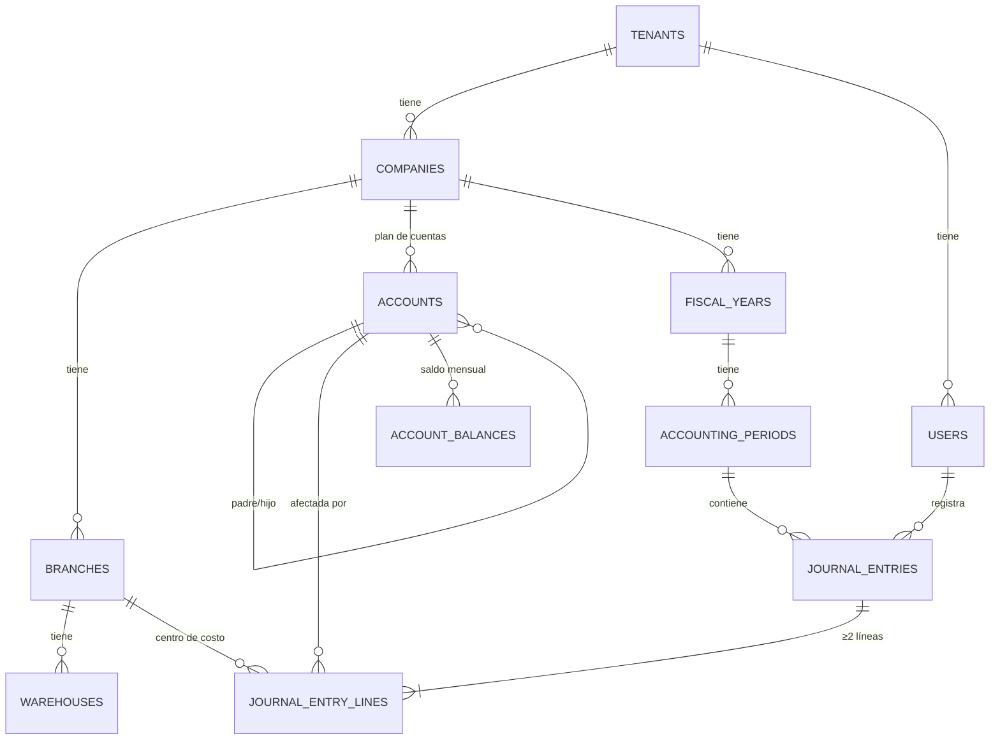
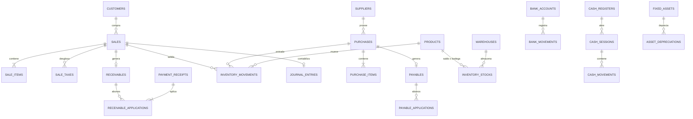
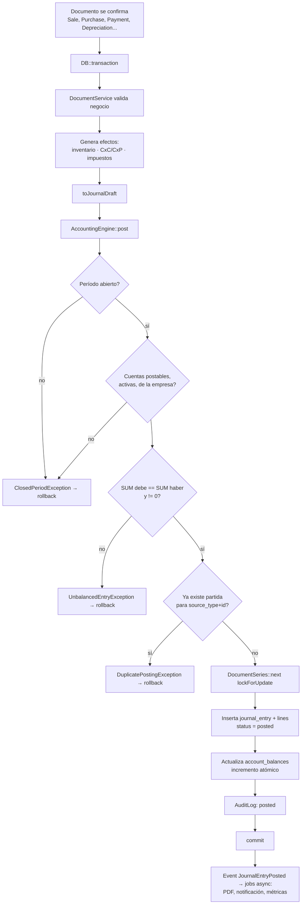

# Cerquín — Documento de Arquitectura

> **Contabilidad y facturación SAR para Honduras.** El nombre viene de Cerquín,
> la región lenca donde Lempira resistió la conquista. Se eligió por descarte
> tras verificar uno por uno que los nombres descriptivos —Contable HN, Kuadre,
> Contalia, DebeHaber— ya los usa una contadora o un ERP del mismo rubro, y que
> DIGEPIH no registra marcas genéricas ni descriptivas.

> Estado: **APROBADA** · Fases 0 a 9 implementadas (CAI, POS y API pública)
> Fecha: 2026-08-09
> Stack real: **Laravel 13.24 · PHP 8.4.11 · MySQL 8.4.6 · Livewire 4.3 · Alpine · Tailwind 4 · Pest 4**

---

## 1. Decisiones de arquitectura (ADR resumidos)

| # | Decisión | Elección | Razón |
|---|---|---|---|
| ADR-01 | Estilo de aplicación | **Monolito modular** (`app/Domains/*`), no microservicios | Un ERP contable es transaccional y fuertemente acoplado por naturaleza. Los microservicios harían imposible la transacción única `venta + inventario + CxC + partida`. |
| ADR-02 | Multi-tenancy | **Base de datos única, esquema compartido, `company_id` + Global Scope** | Costo operativo bajo, migraciones únicas, reportes cross-empresa posibles. Aislamiento reforzado en 3 capas (scope + policy + validación de FK). |
| ADR-03 | Jerarquía | `tenant` (cuenta SaaS) → `company` (empresa contable) → `branch` → `warehouse` | Permite que un contador/grupo administre varias empresas bajo una suscripción. El plan de cuentas y los libros son **por empresa**. |
| ADR-04 | Motor contable | **Servicio central `AccountingEngine` + contrato `Postable` + mapeo de cuentas configurable** | Regla del prompt: no duplicar lógica contable. Todo módulo emite un `JournalEntryDraft`; el engine valida, cuadra, numera y contabiliza. |
| ADR-05 | Acoplamiento módulo↔contabilidad | **Síncrono dentro de la misma transacción** (no colas) | Si la partida falla, la venta debe fallar. Las colas se usan solo para PDF, correo, reportes pesados y depreciación masiva. |
| ADR-06 | Dinero | `DECIMAL(18,4)` importes · `DECIMAL(18,6)` cantidades y costos unitarios · `DECIMAL(18,8)` tasas de cambio | Nunca FLOAT. 4 decimales permiten prorrateos sin pérdida antes del redondeo a 2. |
| ADR-07 | Permisos | `spatie/laravel-permission` con **teams = company_id** | Roles distintos por empresa para el mismo usuario. Probado y mantenido. |
| ADR-08 | Auditoría | Tabla propia `audit_logs` + trait `Auditable` (no paquete genérico) | Necesitamos IP, empresa, sucursal, módulo y motivo de anulación; los paquetes genéricos no lo modelan bien. |
| ADR-09 | Costeo de inventario | **Promedio ponderado móvil** con `inventory_stocks` materializado + `inventory_movements` como libro | Arquitectura preparada para FIFO añadiendo `inventory_layers` sin tocar el contrato `CostingMethod`. |
| ADR-10 | Numeración de documentos | Tabla `document_series` con `lockForUpdate()` dentro de la transacción | Evita huecos y colisiones bajo concurrencia. No usar `MAX(numero)+1`. |
| ADR-11 | Tests | **Pest** + `RefreshDatabase` **contra MySQL real** (`contable_test`), no SQLite en memoria | SQLite no respeta la precisión de `DECIMAL` ni el comportamiento de las FK. Una prueba de cuadre que pasa en SQLite no prueba nada sobre producción. |
| ADR-12 | Impuestos | Motor configurable `taxes` + `tax_rates` con vigencia + `TaxResolver` | Honduras hoy (ISV 15%/18%, exoneraciones, retenciones), otros países después sin refactor. |

### Por qué NO Filament para el core
Filament es excelente para CRUD administrativo, pero las pantallas de facturación y partidas requieren control total del teclado (F-keys, `Enter` avanza celda, autocompletado de cuenta por código). Propuesta: **Livewire puro para el core operativo**, y Filament **solo** para el panel de superadmin SaaS (Fase 8) si se desea.

### Livewire 4: componentes con clase, no SFC
Livewire 4 crea por defecto componentes de archivo único (`sfc`) con prefijo emoji. Se cambió a `type => 'class'` en `config/livewire.php`: la lógica de facturación y de partidas es demasiado extensa para un solo fichero, y las clases permiten agrupar por dominio en `app/Livewire/<Dominio>/`.

### Dónde vive el modelo User
`App\Models\User` se queda donde el framework lo espera. Lo resuelven `config/auth.php`, la convención de factories (`Database\Factories\UserFactory`), Fortify y spatie/laravel-permission. Los modelos **de negocio** sí viven en su dominio (`app/Domains/<Dominio>/Models/`) y declaran su factory y su policy con los atributos `#[UseFactory]` y `#[UsePolicy]` de Laravel 13.

---

## 2. Estructura de carpetas

```
app/
├── Domains/
│   ├── Tenancy/          # tenants, companies, branches, warehouses, subscriptions
│   ├── Identity/         # users, roles, permissions, sessions, audit
│   ├── Accounting/       # ★ NÚCLEO: accounts, periods, journal, engine, ledger
│   ├── Taxation/         # taxes, rates, withholdings, resolver
│   ├── Catalog/          # products, categories, brands, units
│   ├── Inventory/        # movements, stocks, kardex, transfers, costing
│   ├── Partners/         # customers, suppliers (contacts compartidos)
│   ├── Sales/            # quotes, orders, invoices, credit/debit notes, returns
│   ├── Purchases/        # orders, bills, notes, returns
│   ├── Receivables/      # CxC, abonos, antigüedad
│   ├── Payables/         # CxP, abonos, antigüedad
│   ├── Treasury/         # bancos, caja, cheques, conciliación
│   ├── FixedAssets/      # activos, depreciación
│   └── Reporting/        # motor de reportes, exportadores
├── Support/              # Money, Enums, Concerns, ValueObjects
└── Http/
    ├── Middleware/       # SetCurrentCompany, EnsurePeriodOpen
    └── Livewire/         # componentes agrupados por dominio
```

Cada dominio contiene: `Models/`, `Services/`, `Actions/`, `DTOs/`, `Events/`, `Listeners/`, `Policies/`, `Requests/`, `Enums/`, `Exceptions/`.
Las migraciones se mantienen centralizadas en `database/migrations` con prefijo numérico por fase para conservar el orden de las FK.

---

## 3. Modelo de datos

### 3.1 Diagrama ER — Núcleo (Fase 1)



### 3.2 Diagrama ER — Operaciones



### 3.3 Tablas del núcleo (columnas clave)

#### `tenants`
`id`, `name`, `slug` (unique), `plan_id`, `status` (trial|active|suspended|cancelled), `trial_ends_at`, `timestamps`, `deleted_at`

#### `companies`
`id`, `tenant_id` FK, `legal_name`, `trade_name`, `tax_id` (RTN), `address`, `phone`, `email`, `logo_path`,
`country_code` (default `HN`), `currency_code` (default `HNL`), `locale`,
`fiscal_year_start_month` (tinyint, default 1), `decimal_places` (default 2), `rounding_mode`,
`is_active`, `timestamps`, `deleted_at`
· Unique: `(tenant_id, tax_id)`

#### `branches`
`id`, `company_id` FK, `code`, `name`, `address`, `phone`, `is_main` (bool), `is_active`
· Unique: `(company_id, code)`

#### `warehouses`
`id`, `company_id` FK, `branch_id` FK, `code`, `name`, `is_default`, `is_active`
· Unique: `(company_id, code)`

#### `users`
`id`, `tenant_id` FK, `name`, `email` (unique global), `password`, `two_factor_*`,
`default_company_id`, `default_branch_id`, `is_active`, `last_login_at`, `last_login_ip`

#### `company_user` (pivote de acceso)
`company_id`, `user_id`, `branch_id` nullable (null = todas las sucursales)
· PK compuesta `(company_id, user_id)`

#### `accounts` — Plan de cuentas
```
id, company_id FK, parent_id FK nullable,
code            VARCHAR(20)      -- '1.1.01'
name            VARCHAR(150)
type            ENUM(asset,liability,equity,income,cost,expense)
nature          ENUM(debit,credit)          -- naturaleza del saldo
level           TINYINT                     -- derivado de la profundidad
is_postable     BOOLEAN                     -- permite movimientos (solo hojas)
is_system       BOOLEAN                     -- creada por el sistema, no borrable
cash_flow_class ENUM(operating,investing,financing) NULL
requires_partner BOOLEAN                    -- exige cliente/proveedor en la línea
requires_branch  BOOLEAN
currency_code   CHAR(3) NULL                -- cuenta en moneda extranjera
is_active       BOOLEAN
path            VARCHAR(255)                -- materialized path '1/1.1/1.1.01' para consultas jerárquicas
timestamps, deleted_at
```
· Unique: `(company_id, code)` · Index: `(company_id, type)`, `(company_id, path)`
· **Regla:** una cuenta con hijos nunca puede ser `is_postable = true`.
· **Regla:** una cuenta con movimientos no puede cambiar de `type` ni de `nature`.

#### `fiscal_years`
`id`, `company_id`, `name` ('2026'), `starts_on`, `ends_on`, `status` (open|closing|closed), `closed_at`, `closed_by`

#### `accounting_periods`
`id`, `company_id`, `fiscal_year_id`, `number` (1..12), `starts_on`, `ends_on`,
`status` ENUM(open, closed, locked), `closed_at`, `closed_by`
· Unique: `(fiscal_year_id, number)`
· **Regla:** no se puede contabilizar en período `closed`/`locked`. No se cierra un período si existe uno anterior abierto.

#### `journal_entries` — Partidas
```
id, company_id FK, branch_id FK nullable, accounting_period_id FK,
number          VARCHAR(20)     -- correlativo por empresa/año
date            DATE
type            ENUM(opening, standard, adjustment, closing, reversal)
concept         VARCHAR(255)
reference       VARCHAR(100) NULL
source_type     VARCHAR(60) NULL   -- 'sale','purchase','payment','depreciation'...
source_id       BIGINT NULL
currency_code   CHAR(3)
exchange_rate   DECIMAL(18,8) DEFAULT 1
total_debit     DECIMAL(18,4)
total_credit    DECIMAL(18,4)
status          ENUM(draft, posted, voided)
posted_at, posted_by, voided_at, voided_by, void_reason,
reversal_of_id  FK self nullable
created_by, timestamps
```
· Unique: `(company_id, number)`
· **Unique parcial lógica:** `(company_id, source_type, source_id)` cuando `status != voided` → **idempotencia**: un documento no puede contabilizarse dos veces.
· Index: `(company_id, date)`, `(company_id, status)`, `(source_type, source_id)`

#### `journal_entry_lines`
```
id, journal_entry_id FK (cascade), company_id FK (denormalizado para scope),
account_id FK, branch_id FK nullable, line_number SMALLINT,
description   VARCHAR(255) NULL
debit         DECIMAL(18,4) DEFAULT 0
credit        DECIMAL(18,4) DEFAULT 0
partner_type  VARCHAR(30) NULL   -- customer|supplier|employee
partner_id    BIGINT NULL
document_ref  VARCHAR(60) NULL
currency_code, exchange_rate, foreign_amount DECIMAL(18,4) NULL
```
· **CHECK:** `(debit > 0 AND credit = 0) OR (credit > 0 AND debit = 0)` — nunca ambos, nunca ambos cero.
· Index: `(company_id, account_id, journal_entry_id)` → base del Libro Mayor.

#### `account_balances` — Saldos precalculados (rendimiento)
`id`, `company_id`, `account_id`, `accounting_period_id`, `opening_balance`, `period_debit`, `period_credit`, `closing_balance`
· Unique `(account_id, accounting_period_id)`
· Se actualiza en el mismo evento de contabilización (incremento atómico). Permite Balance de Comprobación instantáneo sin escanear el diario.
· Comando `accounting:rebuild-balances` para reconstruir desde `journal_entry_lines` (fuente de verdad).

#### `account_mappings` — Puente configurable módulo↔contabilidad
```
id, company_id, key VARCHAR(60), account_id FK, branch_id nullable
```
Claves del sistema: `sales.revenue`, `sales.receivable`, `sales.tax_payable`, `sales.discount`, `sales.cogs`,
`purchases.payable`, `purchases.tax_credit`, `purchases.expense`, `inventory.asset`, `inventory.adjustment`,
`treasury.cash`, `treasury.bank_default`, `treasury.transit`, `assets.depreciation_expense`,
`assets.accumulated_depreciation`, `receivables.discount`, `payables.discount`, `fx.gain`, `fx.loss`,
`closing.income_summary`, `closing.retained_earnings`.
Resolución en cascada: **producto/categoría → cliente/proveedor → sucursal → empresa (default)**.

#### `audit_logs`
`id`, `company_id` nullable, `user_id` nullable, `event` (created|updated|deleted|posted|voided|printed|exported|login),
`auditable_type`, `auditable_id`, `module`, `old_values` JSON, `new_values` JSON, `reason` TEXT null,
`ip_address`, `user_agent`, `created_at`
· Index `(company_id, created_at)`, `(auditable_type, auditable_id)`

---

## 4. El Motor Contable

### 4.1 Contrato

```php
interface Postable
{
    public function toJournalDraft(): JournalDraft;   // qué asiento produce
    public function postingDate(): CarbonInterface;
    public function postingConcept(): string;
    public function sourceKey(): array;               // ['sale', 1234]
}
```

```php
final class JournalDraft            // DTO inmutable
{
    public function __construct(
        public readonly CarbonInterface $date,
        public readonly string $concept,
        public readonly JournalEntryType $type,
        public readonly array $lines,          // JournalLineDraft[]
        public readonly ?int $branchId = null,
        public readonly ?string $reference = null,
        public readonly string $currency = 'HNL',
        public readonly string $exchangeRate = '1',
        public readonly ?array $source = null,
    ) {}
}
```

### 4.2 Flujo de contabilización



### 4.3 Reglas invariantes (garantizadas en código y en tests)

1. `SUM(debit) == SUM(credit)` en toda partida `posted`. Comparación con **bcmath en string**, nunca con floats.
2. Toda partida tiene **≥ 2 líneas**.
3. Una línea tiene débito **o** crédito, nunca ambos ni ninguno.
4. Solo cuentas con `is_postable = true`, `is_active = true` y `company_id` del contexto actual.
5. `date` debe caer dentro de un `accounting_period` con `status = open`.
6. Una partida `posted` es **inmutable**. Corrección = partida de reversión (`type = reversal`, `reversal_of_id`) que invierte débitos/créditos con la fecha del período abierto.
7. Anular documento ⇒ anular partida ⇒ generar reversión. Nunca `DELETE`.
8. Todo dentro de `DB::transaction()` con `SELECT ... FOR UPDATE` sobre series y stocks.

### 4.4 Ejemplos de asientos (matriz de contabilización)

**Venta de crédito L 10,000 + ISV 15%, costo L 6,000**
```
Partida A (venta)
  D  1.1.03 Clientes                 11,500.00
     C  4.1.01 Ventas                          10,000.00
     C  2.1.03 ISV por pagar                    1,500.00

Partida B (costo, misma transacción — o líneas adicionales de la misma partida)
  D  5.1.01 Costo de ventas           6,000.00
     C  1.1.05 Inventario                       6,000.00
```

**Compra a crédito L 8,000 + ISV acreditable 1,200**
```
  D  1.1.05 Inventario                8,000.00
  D  1.1.08 ISV acreditable           1,200.00
     C  2.1.01 Proveedores                      9,200.00
```

**Cobro de cliente L 11,500 con retención 1% L 115**
```
  D  1.1.02 Bancos                   11,385.00
  D  1.1.09 Retenciones a favor         115.00
     C  1.1.03 Clientes                        11,500.00
```

**Pago a proveedor L 9,200 con cheque**
```
  D  2.1.01 Proveedores               9,200.00
     C  1.1.02 Bancos                           9,200.00
```

**Depreciación mensual L 1,250**
```
  D  6.1.10 Gasto por depreciación    1,250.00
     C  1.2.09 Depreciación acumulada           1,250.00
```

**Nota de crédito por devolución L 1,150 (mercadería costo 600)**
```
  D  4.1.05 Devoluciones sobre ventas 1,000.00
  D  2.1.03 ISV por pagar               150.00
     C  1.1.03 Clientes                         1,150.00
  D  1.1.05 Inventario                  600.00
     C  5.1.01 Costo de ventas                    600.00
```

**Cierre anual** — `ClosingService` genera: saldo de todas las cuentas `income/cost/expense` contra `closing.income_summary`, y el neto contra `closing.retained_earnings`; luego marca el `fiscal_year` como `closed` y crea la partida de apertura del siguiente ejercicio.

---

## 5. Flujos de negocio integrados

### 5.1 Emitir factura de venta

```
SaleService::issue(Sale $sale)
└── DB::transaction
    ├── 1. Validar: período abierto · cliente activo · límite de crédito · stock disponible
    ├── 2. TaxResolver: calcular ISV por línea (incluido/excluido, exoneraciones)
    ├── 3. DocumentSeries::next('sale_invoice', branch)  [lockForUpdate]
    ├── 4. InventoryService::issueStock()  → inventory_movements + inventory_stocks
    │      devuelve el COSTO real (promedio ponderado al momento)
    ├── 5. ReceivableService::open()  → receivables (si condición = crédito)
    │      si es contado → CashMovement o BankMovement
    ├── 6. AccountingEngine::post($sale->toJournalDraft())
    ├── 7. AuditLog
    └── commit → event SaleIssued → jobs: PDF, correo, actualizar dashboard cache
```

### 5.2 Anular factura
```
SaleService::void(Sale $sale, string $reason)
└── DB::transaction
    ├── Validar: período de la factura abierto (si no → nota de crédito, no anulación)
    ├── Validar: sin abonos aplicados
    ├── InventoryService::reverseMovements()   (devuelve al costo original)
    ├── ReceivableService::cancel()
    ├── AccountingEngine::reverse($sale->journalEntry, $reason)
    ├── sale.status = voided (el registro NUNCA se borra)
    └── AuditLog con motivo obligatorio
```

### 5.3 Registrar compra
```
PurchaseService::receive()
└── entrada de inventario (recalcula costo promedio) → CxP → impuesto acreditable → partida
```

### 5.4 Recálculo de costo promedio ponderado
```
nuevo_costo_promedio = (stock_actual × costo_actual + cantidad_entrada × costo_entrada)
                       / (stock_actual + cantidad_entrada)
```
Con `SELECT ... FOR UPDATE` sobre `inventory_stocks(product_id, warehouse_id)`.
Las salidas usan el costo promedio vigente y lo persisten en `inventory_movements.unit_cost` → el Kardex es histórico y auditable.

---

## 6. Aislamiento multi-tenant (defensa en profundidad)

| Capa | Mecanismo |
|---|---|
| 1. Sesión | Middleware `SetCurrentCompany` → `CompanyContext` (singleton) valida que el usuario pertenece a la empresa vía `company_user`. Registrado además como **persistent middleware de Livewire**: la ruta `/livewire/update` solo trae `['web', RequireLivewireHeaders]`, así que sin eso toda acción de un componente correría sin empresa activa |
| 2. Lectura | `BelongsToCompany` trait → `GlobalScope` inyecta `WHERE company_id = ?` en **todo** modelo del dominio |
| 3. Escritura | El mismo trait fija `company_id` en `creating` — el frontend nunca lo envía |
| 4. Autorización | `Policy` por modelo; `before()` deniega si `$model->company_id !== CompanyContext::id()` |
| 5. Relaciones | Form Requests validan FKs con `Rule::exists()->where('company_id', ...)` — impide referenciar una cuenta de otra empresa por ID |
| 6. Base de datos | FK compuestas donde es viable; `company_id` denormalizado en tablas hijas para poder filtrar sin JOIN |
| 7. Pruebas | Suite `TenantIsolationTest`: por cada modelo, usuario A no ve/edita/borra registros de la empresa B (403/404) |

Cambio de empresa: ruta `POST /company/switch/{company}` → valida pertenencia → regenera sesión → invalida caché de permisos.

---

## 7. Roles y permisos

Formato de permiso: `modulo.accion` — ej. `sales.invoice.create`, `accounting.journal.post`, `accounting.journal.void`.

Acciones: `view`, `create`, `update`, `delete`, `void`, `post`, `approve`, `print`, `export`, `close_period`.

| Rol | Alcance |
|---|---|
| **Administrador** | Todo dentro de su empresa, incluye configuración y usuarios |
| **Contador** | Contabilidad completa, cierres, reportes, ve todos los módulos en lectura |
| **Gerente** | Lectura total + aprobaciones + reportes + anulaciones |
| **Vendedor** | Cotizaciones, pedidos, facturas de su sucursal; clientes; sin costos ni utilidad |
| **Cajero** | Facturas de contado, recibos, apertura/cierre de caja |
| **Bodeguero** | Inventario, traslados, ajustes (requieren aprobación), sin precios de venta |
| **Auditor** | Solo lectura global + acceso a `audit_logs`, sin exportar datos sensibles |

Permisos sensibles separados y desactivados por defecto: `sales.invoice.void`, `accounting.journal.void`, `accounting.period.close`, `inventory.adjustment.approve`, `catalog.product.view_cost`, `settings.accounts.update`.

**Regla:** el backend valida siempre. El frontend solo oculta. Toda acción crítica pasa por `Gate::authorize()` en el Service, no solo en el componente Livewire.

---

## 8. Mapa de rutas (núcleo)

```
/login  /logout  /company/switch/{company}
/dashboard

/accounting
  /accounts                  index · create · {id}/edit · import · export
  /periods                   index · {id}/close · {id}/reopen
  /journal                   index · create · {id} · {id}/post · {id}/void · {id}/reverse
  /ledger                    ?account=&from=&to=&branch=
  /reports/trial-balance     /reports/balance-sheet
  /reports/income-statement  /reports/cash-flow
  /settings/account-mappings /settings/series

/sales      /customers /quotes /orders /invoices /credit-notes /receipts /returns
/purchases  /suppliers /orders /bills /debit-notes /payments /returns
/inventory  /products /categories /brands /units /warehouses /stock /kardex /adjustments /transfers
/receivables  /aging /statements
/payables     /aging /statements
/treasury   /banks /movements /reconciliation /cash-registers /cash-sessions
/assets     /fixed-assets /depreciation-runs
/settings   /company /branches /users /roles /taxes /documents /audit

SaaS (Fase 8) — rutas reales
/registro                      alta self-service · pública (middleware `guest`)
/admin/cuentas                 panel del proveedor · middleware `superadmin`, NO `company`

Régimen de facturación (Fase 9A) — rutas reales
/facturacion/puntos-emision            puntos de emisión y autorizaciones (CAI)
/ventas/facturas/{id}/imprimir         factura en PDF con los elementos del SAR
/ventas/notas-credito                  lista · nueva · {id}/editar · {id}/imprimir

Punto de venta (Fase 9B)
/pos                                   mostrador · exige caja abierta y CAI vigente

API pública (Fase 9C) — prefijo /api/v1, guard `sanctum`
/api/tokens                            pantalla de emisión y revocación de tokens
GET  /me                               empresa y alcances del token
GET  /products · /products/{id} · /products/{id}/stock
GET  /customers · /customers/{id} · /customers/{id}/receivables
POST /customers
GET  /sales · /sales/{id}
POST /sales · /sales/{id}/void
```

**Comandos de mantenimiento**

```
php artisan accounting:rebuild-balances [--company=] [--check]
php artisan identity:sync-roles [--company=]   ← correr en cada despliegue que toque PermissionCatalog
```

---

## 9. Servicios principales

| Servicio | Responsabilidad |
|---|---|
| `AccountingEngine` | `post()`, `void()`, `reverse()`, `validateBalance()` — **único punto de escritura del diario** |
| `ChartOfAccountsService` | Crear/mover cuentas, mantener `path` y `level`, seed del plan hondureño |
| `PeriodService` | Abrir/cerrar períodos y ejercicios, validar fecha contable |
| `ClosingService` | Cierre anual, partida de cierre y apertura |
| `LedgerQueryService` | Libro Mayor, saldos, balance de comprobación (usa `account_balances`) |
| `FinancialStatementService` | Balance General, Estado de Resultados, Flujo de Efectivo |
| `TaxResolver` | Calcula impuestos por línea con vigencias, exoneraciones y retenciones |
| `DocumentSeriesService` | Correlativos atómicos por empresa/sucursal/tipo |
| `InventoryService` | Entradas, salidas, traslados, ajustes; delega en `CostingMethod` |
| `AverageCostingMethod` | Implementación de promedio ponderado (interfaz lista para `FifoCostingMethod`) |
| `SaleService` / `PurchaseService` | Orquestan el flujo completo del documento |
| `ReceivableService` / `PayableService` | Apertura, abonos, aplicación, antigüedad |
| `TreasuryService` | Movimientos bancarios, cheques, conciliación |
| `DepreciationService` | Corrida mensual de depreciación (línea recta) |
| `AuditLogger` | Registro uniforme de eventos auditables |
| `ReportEngine` | Definición, filtrado, paginación y exportación PDF/Excel |

---

## 10. Rendimiento

- `account_balances` evita recorrer el diario en cada reporte.
- `inventory_stocks` evita sumar `inventory_movements`.
- Comandos de reconstrucción para ambos (la fuente de verdad siempre son los movimientos).
- Índices compuestos siempre encabezados por `company_id`.
- Particionamiento futuro de `journal_entry_lines` y `audit_logs` por año.
- Colas (`redis` o `database`) para: PDF, correos, exportaciones Excel grandes, depreciación masiva, recálculo de saldos, backups.
- Cache de dashboard por empresa con invalidación por evento.

---

## 11. Experiencia de usuario — productividad de teclado

| Tecla | Acción |
|---|---|
| `Ctrl+K` | Búsqueda global (clientes, productos, facturas, cuentas) |
| `F2` | Nuevo documento en el módulo actual |
| `F4` | Buscar cuenta / producto en la línea activa |
| `F9` | Guardar y contabilizar |
| `F10` | Guardar borrador |
| `Enter` | Avanzar a la siguiente celda; en la última, crear nueva línea |
| `Ctrl+Enter` | Confirmar documento |
| `Esc` | Cerrar modal / cancelar línea |
| `Alt+↑/↓` | Mover entre líneas de la partida |

Autocompletado de cuenta por **código o nombre**, con navegación por flechas. Indicador permanente de **Debe / Haber / Diferencia** en el pie de la partida, en rojo mientras no cuadre; el botón de contabilizar permanece deshabilitado.

---

## 12. Seguridad

- Auth de Laravel (Fortify) + 2FA opcional + política de contraseñas.
- Rate limiting: 5 intentos de login/min por IP+email; 60 req/min en API.
- CSRF en todos los formularios; Livewire lo maneja nativamente.
- Escapado Blade por defecto; `{!! !!}` prohibido salvo HTML sanitizado.
- Solo Eloquent/Query Builder con bindings — cero SQL concatenado.
- `$fillable` explícito; `company_id`, `status`, `posted_at` nunca son fillable.
- Sesiones en base de datos, expiración configurable, cierre de sesiones remotas.
- Backups automáticos diarios (`spatie/laravel-backup`) cifrados y off-site.
- Logs de aplicación separados por canal: `accounting`, `security`, `audit`.

---

## 13. Pruebas

```
tests/
├── Unit/       Money, TaxResolver, AverageCosting, JournalDraft
├── Feature/
│   ├── Accounting/  PostEntryTest, UnbalancedEntryTest, VoidEntryTest,
│   │                ClosedPeriodTest, TrialBalanceTest, ClosingTest
│   ├── Sales/       IssueInvoiceTest, VoidInvoiceTest, CreditNoteTest
│   ├── Purchases/   ReceivePurchaseTest, PaymentTest
│   ├── Inventory/   AverageCostTest, TransferTest, NegativeStockTest
│   ├── Receivables/ ApplyPaymentTest, AgingTest
│   └── Security/    TenantIsolationTest, PermissionTest
└── Invariants/ LedgerBalanceTest   ← SUM(debit) == SUM(credit) global y por partida
```

`LedgerBalanceTest` se ejecuta al final de la suite sobre la base sembrada con datos de todos los flujos: si algún módulo descuadró el libro, falla.

---

## 14. Plan de fases y entregables

| Fase | Contenido | Entregable verificable |
|---|---|---|
| **0** | Setup, CI, layout base, autenticación, tenancy, trait `BelongsToCompany` | Login + selector de empresa funcionando |
| **1** | Empresas, sucursales, bodegas, usuarios, roles, plan de cuentas, períodos, **motor contable**, libro diario, libro mayor | Registrar una partida manual cuadrada y consultarla en el mayor |
| **2** | Balance de comprobación, Balance General, Estado de Resultados, Flujo de efectivo, exportación PDF/Excel, cierre de período y de ejercicio | Estados financieros cuadrados con datos reales |
| **3** | Clientes, cotizaciones, pedidos, facturas, notas de crédito, recibos, CxC, antigüedad | Facturar → ver CxC → ver partida automática |
| **4** | Proveedores, órdenes, compras, notas, pagos, CxP | Comprar → ver CxP → ver partida automática |
| **5** | Catálogo, bodegas, existencias, kardex, costeo promedio, ajustes, traslados | Kardex cuadrado contra la cuenta contable de inventario |
| **6** | Bancos, cheques, conciliación, caja (apertura/cierre/arqueo) | Conciliación bancaria completa |
| **7** | Activos fijos, depreciación línea recta, módulo de impuestos y retenciones | Corrida de depreciación mensual contabilizada |
| **8** | SaaS: planes, suscripciones, límites, facturación del servicio, panel superadmin, métricas | Alta self-service de una empresa nueva |
| **9A** | Régimen de facturación HN (CAI), notas de crédito, impresión fiscal | Factura con CAI, rango y fecha límite, impresa y contabilizada |
| **9B** | POS de mostrador con cobro dividido, enganchado a la caja | Vender con la pistola y que el arqueo lo recoja |
| **9C** | API pública REST con tokens por empresa | Emitir una factura desde otro programa, aislada y con CAI |
| **10** | App móvil (proyecto aparte, sobre la API), webhooks, factura electrónica SAR | Pendiente |

Cada fase cierra con: migraciones + modelos + services + policies + Livewire + vistas + pruebas verdes + documentación de decisiones.

---

## 15. Decisiones de negocio confirmadas (2026-08-09)

| # | Punto | Decisión | Impacto en el diseño |
|---|---|---|---|
| D-01 | Modelo de tenancy | **Una cuenta administra varias empresas** | Se mantiene `tenants → companies → branches`. Selector de empresa en la barra superior, permisos por empresa vía `teams` de spatie. |
| D-02 | Multimoneda | **Solo HNL en Fase 1** | `currency_code` y `exchange_rate` quedan en el esquema con default `HNL`/`1`. Sin tabla de tasas ni diferencial cambiario hasta una fase posterior. Las claves `fx.gain` / `fx.loss` de `account_mappings` quedan reservadas pero sin uso. |
| D-03 | Plan de cuentas | **Catálogo hondureño predefinido** | `HonduranChartOfAccountsSeeder` (4 niveles, cuentas `is_system` protegidas) aplicado al crear la empresa; la empresa lo edita después desde el CRUD. El importador Excel/CSV *no* entra en Fase 1, pero `ChartOfAccountsService` se diseña con un método `createMany(array $rows)` para que añadirlo sea solo una pantalla. |
| D-04 | Inventario sin stock | **Bloquear la venta** | `InventoryService::issueStock()` lanza `InsufficientStockException` dentro de la transacción → la factura completa se revierte. El Kardex nunca queda negativo y el costo promedio siempre es válido. Sin flag configurable en Fase 5. |

### Aún abiertos (no bloquean Fase 1)

5. **Retenciones** — confirmar tipos aplicables (ISR 1% / 12.5%, ISV retenido) y sus cuentas. *Necesario en Fase 7.*
6. ~~**Costo de ventas**~~ — resuelto en la Fase 3: misma partida que la factura, líneas adicionales. La Fase 5 las alimenta con el costo real del kardex.
7. ~~**Listas de precios**~~ — resuelto en la Fase 3: tabla `price_lists` + `product_prices`, sin motor de reglas.

---

## 16. Fase 0 — completada (2026-08-09)

### Qué quedó funcionando

| Área | Entregado |
|---|---|
| Base | Laravel 13.24, MySQL 8.4 (`contable` y `contable_test`), Tailwind 4 + Vite 8, Livewire 4, Pest 4, Pint |
| Tenancy | `tenants` → `companies` → `branches` → `warehouses` + `company_user`; columnas de tenancy en `users` |
| Aislamiento | `CompanyContext`, `CompanyScope`, trait `BelongsToCompany`, middleware `SetCurrentCompany`, regla `BelongsToCurrentCompany`, policies de las 3 entidades |
| Auth | Fortify con vistas propias en español, 2FA disponible, rate limiting 5/min, rechazo de usuarios inactivos y cuentas suspendidas, registro de último acceso |
| UI | Layout con menú lateral, selector de empresa, menú de usuario, pantalla “sin empresa”, CRUD de empresas/sucursales/bodegas con modales |
| Pruebas | **36 pruebas, 99 aserciones, todas en verde** |

### Decisiones tomadas durante la implementación

1. **Registro público desactivado** (`Features::registration()` comentado). Un usuario registrado hoy nacería sin tenant ni empresa. → *Resuelto en la Fase 8, pero no reactivando Fortify: el alta pasa por `SignupService`, que crea usuario, cuenta, suscripción y empresa operativa en una sola transacción. El registro de Fortify sigue apagado a propósito.*
2. **El scope global lanza en vez de no filtrar.** Sin empresa activa, consultar un modelo aislado lanza `MissingCompanyContextException`. Un scope que se desactiva solo cuando falta contexto es justamente el bug que filtra datos entre empresas en consolas, jobs y peticiones mal enrutadas. Para cruzar empresas hay que pedirlo: `CompanyContext::unscoped()`.
3. **Prohibido mover un registro entre empresas.** El trait lanza si `company_id` cambia en un `update`.
4. **`Model::shouldBeStrict()` en local.** Lazy loading y atributos descartados en silencio fallan durante el desarrollo.
5. **El flash lo renderiza el componente Livewire, no el layout.** Una acción de Livewire re-renderiza solo el componente; un flash puesto únicamente en el layout nunca se vería.

### Bug encontrado y corregido al verificar en el navegador

El botón «Nueva sucursal» devolvía **403**. Causa: Livewire registra `/livewire/update` con solo `['web', RequireLivewireHeaders]` y reaplica por su cuenta el middleware de autenticación, pero no el propio. Cada acción de componente corría sin empresa activa y la policy denegaba.

Corrección: `Livewire::addPersistentMiddleware(SetCurrentCompany::class)` en `AppServiceProvider`.

**Lección para las fases siguientes:** las pruebas de componentes (`Livewire::test()`) no atraviesan la ruta HTTP y el helper fija el contexto a mano, así que este fallo pasó verde en la suite. Todo middleware que el sistema necesite dentro de una acción de Livewire debe registrarse como persistente, y existe `tests/Feature/Security/LivewireMiddlewareTest.php` como guardia de regresión.

### Cómo levantar el proyecto

```bash
cd "C:\Users\RTX 5060TI\contable"
php artisan migrate:fresh --seed
npm run build
php artisan serve --port=8010
```

Acceso de demostración: `admin@contable.test` (dos empresas) y `vendedor@contable.test` (una sola empresa, para comprobar el aislamiento a mano). Contraseña: `password`.

---

## 17. Fase 1 — completada (2026-08-10)

### Qué quedó funcionando

| Área | Entregado |
|---|---|
| Aritmética | Value object `Money` con bcmath sobre strings, escala 4, redondeo comercial half-up. Rechaza `float` en el constructor |
| Plan de cuentas | 9 tablas nuevas; catálogo hondureño de 103 cuentas por empresa con jerarquía, ruta materializada y contra-cuentas |
| Períodos | Ejercicios fiscales con mes de inicio configurable y sus 12 períodos; apertura, cierre en orden, reapertura y bloqueo |
| **Motor contable** | `AccountingEngine`: contabilizar, borrador, anular, revertir; cuadre en bcmath, idempotencia por documento, correlativo con bloqueo de fila, saldos atómicos |
| Libro diario | Lista con filtros, captura por código de cuenta con totales en vivo, contabilizar / anular / revertir con motivo |
| Libro mayor | Saldo inicial arrastrado, movimientos y saldo acumulado según la naturaleza de la cuenta, filtro por sucursal |
| RBAC | 37 permisos, 7 roles por empresa (`teams = company_id`) |
| Auditoría | Tabla `audit_logs` inmutable con valores anteriores/nuevos, IP, usuario y motivo |
| Pruebas | **127 pruebas, 365 aserciones, todas en verde** |

### Decisiones tomadas durante la implementación

1. **`account_balances` guarda solo el movimiento del período, no el saldo final.** Un saldo final almacenado obliga a propagar en cascada hacia todos los períodos siguientes cada vez que se contabiliza algo en uno anterior; basta con que una cascada falle para que el balance mienta. El saldo inicial se calcula sumando los movimientos previos, que es exacto por construcción.
2. **Anular y revertir son operaciones distintas.** `void()` solo procede con el período abierto: marca la partida como anulada, conserva folio y líneas, y resta su efecto. `reverse()` crea una partida nueva con los importes al lado contrario, fechada en un período abierto, y deja la original intacta — es la única corrección válida cuando el período ya se cerró.
3. **El borrador no consume folio.** `journal_entries.number` es nullable y se asigna al contabilizar; numerar borradores dejaría huecos en el libro.
4. **Idempotencia garantizada en la base de datos**, con una columna generada `source_key` que vale NULL cuando la partida está anulada. MySQL no soporta índices únicos parciales, y los NULL sí se repiten en un índice único.
5. **Restricción CHECK a nivel de base de datos** en `journal_entry_lines`: cargo o abono, nunca ambos ni ninguno. Cubre cualquier ruta de escritura futura, no solo el motor.
6. **Naturaleza explícita en las contra-cuentas.** Depreciación acumulada es tipo activo con saldo acreedor; devoluciones sobre ventas es tipo ingreso con saldo deudor. Deducir la naturaleza solo del tipo daría un balance invertido en esas cuentas.
7. **La configuración inicial de una empresa corre dentro de su propio contexto** (`CompanyContext::runFor`). El scope global apunta a la empresa activa, que al crear una empresa nueva es otra.

### Bugs encontrados y corregidos al verificar en el navegador

**1. `MassAssignmentException` al guardar una partida.** El motor asignaba `company_id` en masa al crear las líneas, y esa columna no es asignable a propósito. La suite pasaba en verde porque el modo estricto de Eloquent solo estaba activo en `local`: en pruebas el atributo se descartaba en silencio y el trait de tenancy lo rellenaba después.

Corrección: `forceFill` explícito en el motor, y **`Model::shouldBeStrict(! isProduction())`**, de modo que las pruebas corran con las mismas reglas que la aplicación.

**2. `MissingAttributeException` en el middleware de empresa.** Al activar el modo estricto en pruebas apareció un segundo fallo: un usuario recién creado sin `tenant_id` no tiene ese atributo hidratado, y el middleware revienta al leer `$user->tenant` en la misma petición. Corregido con valores por defecto en `$attributes` del modelo `User`.

**Lección para las fases siguientes:** un entorno de pruebas más permisivo que producción produce suites verdes sobre código roto. El modo estricto va activo en todos los entornos menos producción.

### Cómo probarlo

```bash
cd "C:\Users\RTX 5060TI\contable" && php artisan migrate:fresh --seed && php artisan serve --port=8010
```

Entrar como `contador@contable.test` / `password`. El seeder deja seis partidas de ejemplo (aporte de capital, compra con ISV acreditable, venta con ISV por pagar, costo de venta, cobro y planilla) para que el diario y el mayor no aparezcan vacíos.

---

## 18. Fase 2 — completada (2026-08-10)

### Qué quedó funcionando

| Área | Entregado |
|---|---|
| Balance de comprobación | Saldo inicial, movimiento y saldo final por cuenta, con columnas deudora y acreedora e indicador de cuadre |
| Estado de resultados | Ingresos − costos = utilidad bruta; − gastos = utilidad neta, por rango de fechas y sucursal |
| Balance general | Activo, pasivo y patrimonio a fecha de corte, agrupados por grupo de segundo nivel, con la utilidad del ejercicio como línea de patrimonio |
| Flujo de efectivo | Método directo, clasificado en operación, inversión y financiamiento, con conciliación contra el saldo real de caja |
| Cierre de ejercicio | Cancelación de cuentas de resultado contra Resumen de Resultados y traslado a Utilidades Retenidas |
| Exportación | PDF (dompdf) y Excel (PhpSpreadsheet) desde un mismo `ReportDocument`, con encabezado de empresa, período y espacio de firmas |
| Mantenimiento | `php artisan accounting:rebuild-balances [--check]` reconstruye o verifica los saldos materializados contra el diario |
| Pruebas | **175 pruebas, 493 aserciones, todas en verde** |

### Decisiones tomadas durante la implementación

1. **Las partidas de cierre se tratan distinto en cada estado.** El estado de resultados las **excluye** —si no, el reporte de un ejercicio ya cerrado saldría en cero y el contador no podría reimprimirlo—. El balance general las **incluye**, de modo que la utilidad del ejercicio vale el resultado real mientras el año está abierto y cero una vez cerrado, cuando ya vive en Utilidades Retenidas. El balance cuadra en ambos momentos.

2. **No se genera partida de apertura, y es deliberado.** El libro es continuo: las cuentas de balance acumulan su saldo y el balance general las lee desde el origen. Una partida de apertura volvería a registrar esos saldos y los contaría dos veces. La apertura solo tiene sentido cuando cada ejercicio es un libro separado, que no es el caso aquí. Al crear el ejercicio siguiente no hay que hacer nada.

3. **Flujo de efectivo derivado del propio libro, sin tabla de clasificación aparte.** Como toda partida cuadra, en cualquier partida que toque caja se cumple que `Σ(líneas de efectivo) = −Σ(líneas que no son efectivo)`. Por eso a cada línea que no es de efectivo se le atribuye `haber − debe` como aporte al flujo: la suma da la variación real de caja, sin estimaciones ni prorrateos. Las pruebas verifican esa identidad, incluidos los traslados internos entre caja y bancos, que no alteran el efectivo total.

4. **Nueva columna `accounts.is_cash_equivalent`.** Deducir qué es caja por el código de cuenta ataría el reporte al catálogo hondureño; una bandera explícita funciona con cualquier plan.

5. **Un solo `ReportDocument` para pantalla, PDF y Excel.** Sin esa capa habría que mantener el mismo reporte escrito tres veces y acabarían divergiendo. En Excel los importes se escriben como número, no como texto ya formateado: quien exporta un balance espera poder sumar la columna.

### Bugs encontrados durante la fase

**1. El balance general no cuadraba.** La utilidad del ejercicio sumaba ingresos, costos y gastos sin signo, inflando el patrimonio. Detectado por la prueba de cuadre antes de llegar a la pantalla.

**2. `orderByDesc` sin efecto sobre una relación preordenada.** `ClosingService` pedía el último período con `$year->periods()->orderByDesc('number')->first()`, pero la relación `periods()` ya trae un `orderBy` ascendente y el segundo criterio se encadena en vez de sustituirlo: devolvía Enero en lugar de Diciembre. Corregido con una consulta directa sobre `AccountingPeriod` y documentado en la relación.

**3. El PDF fallaba en el navegador con «Malformed UTF-8 characters».** `Pdf::download()` devuelve una `Response` con cuerpo binario que Livewire intenta serializar como JSON. Corregido devolviendo `StreamedResponse`, igual que el Excel. Las pruebas iniciales no lo detectaban porque solo comprobaban la extensión del archivo; ahora ejecutan el streaming y verifican que el PDF empiece por `%PDF-` y termine en `%%EOF`, y que el XLSX sea un ZIP legible con importes numéricos.

**Nota operativa:** no usar `Get-Content`/`Set-Content` de PowerShell 5.1 para transformar archivos PHP. Lee como ANSI y escribe con BOM, lo que corrompe los acentos y rompe `declare(strict_types=1)`.

---

## 19. Fase 3 — completada (2026-08-11)

### Qué quedó funcionando

| Área | Entregado |
|---|---|
| Catálogo | Unidades, categorías, productos y servicios, listas de precios e impuestos configurables |
| Clientes | CRUD con RTN, lista de precios asignada, límite y días de crédito, saldo en vivo |
| Facturación | Borrador y emisión, correlativo por sucursal, descuentos e impuestos por línea, concepto libre sin producto, anulación con motivo |
| Cuentas por cobrar | Apertura automática en ventas al crédito, saldo como columna generada, antigüedad por tramos y estado de cuenta |
| Recibos | Cobro aplicable a varias facturas, reparto automático a los documentos más antiguos, anulación que devuelve saldos |
| Contabilidad | Toda factura y todo recibo generan su partida por el mismo motor, con las mismas garantías de cuadre e idempotencia |
| Pruebas | **228 pruebas, 636 aserciones, todas en verde** |

### Las dos decisiones que se investigaron

**Costo de ventas en la misma partida que la factura.** La contabilidad clásica manda dos asientos separados en sistema perpetuo, pero los ERP modernos —Odoo con contabilidad anglosajona— lo incluyen en la misma partida. Se eligió lo segundo por una razón concreta del diseño existente: el motor garantiza la idempotencia con un índice único sobre `(source_type, source_id)`; dos partidas por documento obligarían a inventar dos claves y a coordinar dos anulaciones. `SaleService::appendCostOfSales()` ya añade las líneas cuando hay costo unitario; en la Fase 5 el kardex lo llenará y aparecerán solas.

**Listas de precios en tabla, no columnas fijas.** El plan original asumía `precio` y `precio_mayorista`. Se sustituyó por `price_lists` + `product_prices` con tres listas sembradas (Detalle, Mayorista, Distribuidor), porque añadir un cuarto nivel debe ser un dato, no una migración que obligue a tocar todas las pantallas. Sin motor de reglas ni fórmulas: un precio plano por producto y lista, ampliable después sin rehacer el modelo.

### Decisiones tomadas durante la implementación

1. **La tasa del impuesto se copia en la línea.** Si mañana el ISV pasa de 15 % a 16 %, las facturas ya emitidas deben seguir mostrando el 15 % con el que se emitieron. Lo mismo con la descripción del producto.
2. **El impuesto se redondea por línea, no sobre el total.** Es lo que hace que el total impreso coincida con la suma de las líneas impresas; redondear solo el total deja un centavo de diferencia al sumar la columna a mano.
3. **El saldo de la cuenta por cobrar es una columna generada** (`original_amount - paid_amount`). Un saldo actualizado a mano puede desfasarse de lo cobrado, y entonces la antigüedad de saldos miente.
4. **La factura de contado carga a caja o banco; la de crédito, a clientes.** Solo la segunda abre cuenta por cobrar.
5. **El ingreso se acredita bruto y el descuento se carga aparte**, para que el estado de resultados muestre venta y rebaja por separado.
6. **`Money::times()` y `dividedBy()` ahora redondean en vez de truncar.** `bcmul` con escala fija trunca: en una factura de muchas líneas esos truncamientos se acumulan siempre hacia abajo.

### Bugs encontrados durante la fase

**1. `updatedLines()` no se dispara con propiedades anidadas.** En Livewire 4, el hook por propiedad de `lines.0.product_code` se llama `updatedLines0ProductCode` —con el índice dentro—, así que `updatedLines()` nunca se ejecutaba. Afectaba al autocompletado de producto en facturas **y** al borrado del lado contrario en el libro diario, en ambos casos **sin ningún error visible**. Corregido usando el hook genérico `updated($property, $value)` y cubierto con pruebas en `SaleFormTest`.

**2. Relación anidada perdida al recargar.** `SaleService::issue()` hacía `$sale->refresh()->load('items')`, lo que descartaba `items.product` cargado antes y hacía fallar la resolución de cuentas por producto bajo `preventLazyLoading`.

**3. Asignación masiva de `company_id`** en factories y en el seeder de precios, la misma clase de error que ya apareció en la Fase 1. El modo estricto en pruebas lo detectó de inmediato.

### Alcance deliberadamente fuera de esta fase

- **Sin inventario:** los productos son catálogo. Existencias, kardex y costo promedio son Fase 5, y solo entonces las facturas descargarán mercadería y llevarán costo de ventas.
- **Sin notas de crédito ni devoluciones:** una factura mal emitida se anula. Las notas de crédito entran cuando exista inventario, porque una devolución mueve existencias. → *Resuelto en la Fase 9A: llevan además su propia autorización del SAR, que no existía hasta entonces.*
- **Sin impresión de factura en PDF:** el permiso `sales.invoices.print` ya existe; el formato depende del régimen de facturación (CAI) que se define en la Fase 9. → *Resuelto en la Fase 9A.*

---

## 20. Fase 4 — completada (2026-08-11)

### Qué quedó funcionando

| Área | Entregado |
|---|---|
| Proveedores | CRUD con RTN, contacto, días de crédito concedidos y saldo en vivo |
| Compras | Borrador y recepción, correlativo interno, impuesto acreditable, destino por línea a inventario o gasto, anulación con motivo |
| Cuentas por pagar | Apertura automática en compras al crédito, saldo como columna generada, antigüedad por tramos y estado de cuenta |
| Pagos | Aplicables a varias facturas del mismo proveedor, con cheque o transferencia, y anulación que devuelve saldos |
| Pruebas | **259 pruebas, 718 aserciones, todas en verde** |

### Decisiones tomadas durante la implementación

1. **El costo entra neto de descuentos, al revés que en ventas.** En una factura de venta el ingreso se acredita bruto y el descuento se carga a una cuenta aparte, porque el estado de resultados debe mostrar venta y rebaja por separado. En una compra, el descuento comercial **reduce el costo**: el inventario tiene que quedar registrado a lo que realmente costó, porque de ese importe saldrá el costo promedio de la Fase 5. La asimetría es deliberada.

2. **El impuesto de compra usa la cuenta de crédito fiscal, no la de débito.** Cada impuesto lleva sus dos cuentas precisamente para esto: en una venta el ISV es una deuda con el fisco, en una compra es un derecho a favor. Hay prueba de que la partida de compra no toca la cuenta de ISV por pagar.

3. **El número de factura del proveedor es único por proveedor**, garantizado con un índice sobre columna generada. Registrar dos veces la misma factura duplicaría el gasto y el crédito fiscal, que es de los errores más caros que se cometen en un módulo de compras.

4. **La restricción de unicidad solo aplica a las compras recibidas.** Al principio incluía también los borradores, y eso hacía que el usuario viera el error crudo de MySQL —«Duplicate entry»— en vez del mensaje que explica el problema. Un borrador es trabajo en curso; la restricción debe morder cuando el documento se vuelve real.

5. **La cuenta de destino se resuelve en cascada por línea:** cuenta indicada en la línea → cuenta del producto → inventario si lleva existencias, o `6.1.12 Compras y Gastos Varios` si no. Un mismo proveedor factura mercadería y servicios en el mismo documento, y cada línea puede ir a un gasto distinto.

6. **Tabla propia de proveedores, no compartida con clientes.** Aunque hoy los campos se parecen, las reglas divergen enseguida —retenciones, tipo de contribuyente, cuentas contables— y una tabla común acabaría llena de columnas que solo aplican a la mitad de los registros.

### Segunda invariante: la cuenta de control cuadra con su auxiliar

Al revisar las pantallas apareció un descuadre que ninguna prueba detectaba: la antigüedad de saldos por pagar mostraba 32,610 mientras el balance general decía 124,610 en Proveedores. El libro estaba perfectamente cuadrado —la invariante de partida doble seguía pasando— pero los dos números que ve el usuario no coincidían.

El culpable eran los asientos manuales de demostración de la Fase 1, escritos cuando todavía no existían los módulos de ventas y compras: acreditaban 92,000 directo a Proveedores sin documento que lo respaldara. El auxiliar solo conoce documentos, así que ese importe le era invisible.

Es un problema real de diseño contable, no un descuido del dato de prueba: **una cuenta de control es territorio exclusivo de su auxiliar.** Se hicieron dos cosas:

1. Los asientos de ejemplo del seeder se cambiaron por operaciones que de verdad se registran a mano —alquiler, planilla, comisiones bancarias— y las cuentas de control quedaron solo en manos de los documentos.
2. Se añadió `tests/Invariants/SubledgerReconciliationTest.php`, que ejercita ventas, compras, cobros, pagos y anulaciones y después compara el saldo contable de cada cuenta de control contra la suma de los saldos del auxiliar, usando el mismo filtro `outstanding()` que alimenta el reporte de antigüedad. Una tercera prueba verifica que los datos de demostración no vuelvan a tocar esas cuentas a mano.

Pendiente para una fase futura: impedir a nivel de motor que un asiento manual toque una cuenta marcada como de control. Hoy la disciplina la sostiene la prueba, no el código.

### Verificación

Con los datos demo corregidos, el balance general cuadra en 256,421.00 y ambas cuentas de control coinciden con su reporte: Clientes 20,015 y Proveedores 32,610. La suite completa está en **262 pruebas y 723 aserciones**.

### Alcance fuera de esta fase

- **Sin órdenes de compra:** se registra la factura del proveedor directamente. La orden de compra es un documento previo sin efecto contable y encaja mejor junto al inventario.
- **Sin notas de crédito de proveedor ni devoluciones:** una compra mal registrada se anula. Las devoluciones mueven existencias y van con la Fase 5.
- **Sin retenciones:** el ISR retenido y el ISV retenido son Fase 7; las cuentas y las claves de mapeo ya existen.

---

## 21. Fase 5 — completada (2026-08-11)

### Qué quedó funcionando

| Área | Entregado |
|---|---|
| Kardex | Libro de existencias inmutable, con saldos corridos de cantidad y valor |
| Costeo | Promedio ponderado móvil por producto y bodega, con bloqueo de fila |
| Ventas | La factura descarga la bodega y asienta su costo de ventas real |
| Compras | La recepción ingresa la mercadería al costo neto de la factura |
| Ajustes | Sobrantes y faltantes con motivo obligatorio y partida contable |
| Traslados | Entre bodegas, con el costo viajando con la mercadería y sin partida |
| Pantallas | Existencias con puntos de reorden, kardex, ajustes y traslados |
| Pruebas | **335 pruebas, 926 aserciones, todas en verde** |

### La decisión que sostiene toda la fase

**Lo que se guarda es el par (cantidad, valor). El costo promedio se deriva.**

La alternativa —guardar el costo promedio y calcular el valor multiplicando— parece equivalente y no lo es. El promedio casi nunca es exacto: 100 lempiras entre 3 unidades da 33.333333…, y guardarlo redondeado significa que cada operación posterior arrastra un resto que no está en ninguna cuenta contable. A los pocos meses el kardex valorizado y el saldo de la cuenta de inventario dejan de coincidir, y no hay forma de saber cuál de los dos miente.

Guardando el valor, lo que se asienta en contabilidad y lo que se guarda en el kardex son literalmente el mismo número. En `inventory_stocks` el promedio es una columna generada (`total_value / quantity`), así que no se puede guardar a mano ni por error.

De esa decisión salen tres consecuencias que también quedaron en el código:

1. **Una entrada trae su valor; una salida lo averigua.** `StockMovementDraft::in()` exige `Money` y `out()` no lo acepta. Al recibir, el valor lo dicta la factura del proveedor y es exactamente lo que se cargó a la cuenta de inventario. Al despachar, sale del promedio vigente, y nadie puede imponerlo desde fuera.

2. **La salida se valora repartiendo, no multiplicando.** El costo que sale es `valor en existencia × cantidad que sale / cantidad en existencia`, calculado de una sola vez. Con `promedio × cantidad`, sacar 3 unidades de una en una que costaron 100 daría 33.33 tres veces —99.99— y dejaría un centavo de inventario sin unidades detrás. Además, **la salida que vacía la bodega se lleva todo el valor restante**, de modo que el saldo queda en cero exacto.

3. **`sale_items` guarda `cost_total`, no solo `unit_cost`.** El costo unitario es un cociente ya redondeado; volver a multiplicarlo por la cantidad puede dar un centavo distinto al que salió del kardex. Como esas dos cifras llegan a la misma cuenta por caminos distintos —una por el kardex, otra por la partida—, tienen que ser el mismo número. Por eso se guarda el importe exacto y `unit_cost` queda como dato informativo.

También se añadió `Money::ofRounded()`: `Money::of()` trunca los decimales sobrantes, que es lo correcto para un importe que ya viene con su escala, pero pierde sistemáticamente hacia abajo en un cociente.

### Otras decisiones

4. **Vender sin existencia bloquea la factura.** Estaba decidido desde el principio (D-04) y se implementó sin interruptor: `InsufficientStockException` sube dentro de la transacción y la factura entera se revierte. Permitir existencias negativas deja el costo promedio sin significado, y con él el costo de ventas y la utilidad.

5. **Anular devuelve la mercadería por el valor con el que salió, no por el promedio de hoy.** Es obligatorio para que el kardex mueva lo mismo que la reversión contable, y además es lo correcto: si después de aquella compra entró mercadería más cara, lo que queda en bodega es la cara, y el promedio debe reflejarlo. Como consecuencia, **no se puede anular una compra cuya mercadería ya se vendió**: la corrección de ese caso es una devolución al proveedor, que es otro documento.

6. **Los traslados no generan partida contable.** La cuenta de inventario es una sola para la empresa; mover mercadería de un estante a otro no cambia su saldo, y un asiento que cargue y abone la misma cuenta por el mismo importe es ruido sin información. Lo que sí generan son dos movimientos de kardex por línea, con el costo viajando con la mercadería.

7. **La bodega va en la cabecera del documento, no en cada línea.** Un documento se despacha o se recibe en una bodega; permitir una bodega por línea complica la captura para resolver un caso que en la práctica se maneja con dos documentos. Es nullable porque una factura de solo servicios no tiene bodega que declarar.

8. **El kardex se lee en orden de registro, no de fecha.** Los saldos corridos se guardan calculados para imprimir sin recorrer la historia, y reflejan el orden en que se registraron los movimientos —como un libro de papel—. Ordenarlo por fecha mostraría una columna de saldo que no progresa.

### La invariante de la fase

`tests/Invariants/KardexReconciliationTest.php` es el criterio de aceptación: **el kardex valorizado tiene que dar el saldo de la cuenta contable de inventario.** Son dos registros independientes de la misma realidad, escritos por servicios distintos, y que coincidan no lo garantiza ninguna llave foránea. La prueba ejercita comprar, vender, ajustar, trasladar y anular cada uno, con importes que no reparten en partes iguales, y compara: el total, el desglose por producto y bodega, y los saldos corridos de cada movimiento recalculados desde cero.

Verificado también en el sistema corriendo: con los datos de ejemplo, la pantalla de existencias y el balance general dan ambos 31,090.00, y tras un faltante de 5 sacos capturado desde la pantalla, ambos bajan a 30,340.00.

### El bug que solo apareció en el navegador

El contador no podía abrir el formulario de ajustes: le había dado permiso para **aprobar** ajustes pero no para **capturarlos**, siguiendo la idea de que quien cuenta la mercadería no debería ser quien justifica el faltante. La separación es correcta como capacidad del rol Bodeguero —que captura sin aprobar—, pero convertida en un bloqueo al contador dejaba el módulo inalcanzable en una empresa pequeña, donde el contador hace las dos cosas. Se corrigió dándole ambos permisos y se añadió `InventoryScreensTest`, que comprueba lo que cada rol alcanza. Ninguna prueba lo habría detectado antes porque ninguna probaba los permisos de las pantallas nuevas.

### Alcance deliberadamente fuera de esta fase

- **Sin FIFO ni lotes:** ADR-09 dejó la arquitectura preparada para añadir `inventory_layers` sin tocar el contrato del costeo, pero el promedio ponderado es lo que usa la práctica hondureña y lo único implementado.
- **Sin mercadería en tránsito:** el traslado sale y entra en el mismo acto. Un tránsito real necesita una bodega virtual y un documento de recepción aparte.
- **Sin órdenes de compra ni devoluciones:** la devolución al proveedor y la nota de crédito al cliente mueven existencias y valor, y son documentos propios; hoy el camino es anular.
- **Sin series ni vencimientos:** el control por lote y fecha de vencimiento cambia la unidad de costeo y merece su propia fase.
- **Sin ensambles ni producción:** transformar insumos en producto terminado es un módulo aparte.

---

## 22. Fase 6 — completada (2026-08-12)

### Qué quedó funcionando

| Área | Entregado |
|---|---|
| Cuentas bancarias | Metadatos sobre una cuenta contable, con chequera y saldo leído del libro |
| Cheques | Girados automáticamente por el pago con cheque, con seguimiento entregado/cobrado |
| Conciliación | Marcado de partidas contra el extracto, con los cuatro importes en vivo y cierre bloqueado si no cuadra |
| Caja | Apertura con fondo, arqueo al cierre y diferencia contabilizada |
| Pruebas | **381 pruebas, 1 048 aserciones, todas en verde** |

### La decisión que sostiene la fase

**Se concilian líneas del libro diario, no documentos.**

Todo lo que toca el banco aterriza como línea en su cuenta contable: un recibo de cobro, un pago a proveedor, una compra de contado, una comisión registrada a mano. Conciliar documentos habría dejado fuera las partidas manuales, que en un extracto real son la mitad de las líneas —comisiones, intereses, notas de débito—.

De ahí sale que los cuatro importes de la conciliación se deriven de **una sola fuente**:

```
saldo en libros       = todas las líneas hasta la fecha de corte
depósitos en tránsito = cargos sin marcar
cheques pendientes    = abonos sin marcar
```

Con esas definiciones la identidad `extracto + tránsito − pendientes = libros` se cumple por construcción, y cuando no se cumple la diferencia es exactamente lo que falta por explicar, que es la información útil.

### Otras decisiones

1. **La cuenta bancaria no guarda saldo.** Es metadato sobre una cuenta contable —banco, número, chequera—; el saldo se pregunta al libro. Un saldo propio sería un segundo número que mantener de acuerdo con el primero, que es el error que costó aprender con el kardex en la Fase 5.

2. **La tabla de cheques no entra en la aritmética.** Existe y sabe qué cheques no ha pagado el banco, pero el importe de «cheques pendientes» sale de los abonos sin marcar. Un cheque girado ya produjo su abono en el libro: contarlo otra vez desde su propia tabla lo restaría dos veces. La tabla sirve para que el usuario vea *cuáles* son.

3. **El marcado vive en su propia tabla, no como bandera en la línea.** Una bandera diría «esto está conciliado» pero no en cuál conciliación, y desconciliar no dejaría rastro. Además `journal_entry_lines` es inmutable desde la Fase 1. Un índice único sobre la línea impide conciliarla dos veces.

4. **«No marcado» significa no marcado en ninguna conciliación anterior.** El saldo de un extracto es acumulativo: lo que el banco cobró en enero también está dentro del saldo de febrero. Si solo se descontara lo marcado en la conciliación actual, todo enero reaparecería en febrero como depósito en tránsito y la identidad no cerraría nunca a partir del segundo mes. Lo detecté releyendo mi propia aritmética antes de ejecutar las pruebas; hay dos casos de dos meses seguidos que lo cubren.

5. **Emitir o cobrar un cheque no genera partida.** El asiento lo hizo el pago. Que el banco lo cobre tres días después es información para la conciliación, no un hecho contable nuevo — y esa asimetría entre libro y banco es justamente la razón de ser de la conciliación.

6. **El arqueo contabiliza siempre la diferencia.** No se permite ajustar el conteo para cuadrar: una caja que cuadra a la fuerza no es un arqueo, es un dato borrado. Un faltante carga `6.3.04 Sobrantes y Faltantes de Caja` y abona caja.

7. **Cada caja necesita su propia cuenta contable.** Lo esperado se calcula recorriendo el libro entre la apertura y el cierre, por cuenta y sucursal; dos cajas compartiendo cuenta no podrían arquearse por separado. Es también la práctica habitual. Un índice único sobre columna generada impide dos sesiones abiertas en la misma caja.

### Los dos errores que solo aparecieron en el navegador

**1. Pantalla caída por enlace de modelo en la ruta.** `ReconciliationView` recibía el modelo enlazado desde la URL, y `SubstituteBindings` corre **antes** del middleware que activa la empresa: la consulta salía sin contexto y el filtro por empresa la rechazaba con un error 500. El resto del proyecto recibe el id como entero y busca el modelo dentro de `mount` —por esto exactamente—, y yo había roto la convención sin darme cuenta.

**2. El contador no podía abrir la caja.** Los permisos se repartieron pensando en una empresa con cajero dedicado. Es el mismo error que la Fase 5 con los ajustes de inventario, y la corrección es la misma: la segregación vive en el rol Cajero —que opera la caja sin ver bancos ni conciliaciones—, no en un bloqueo al contador.

Se añadió `TreasuryScreensTest`, que comprueba qué alcanza cada rol en las cuatro pantallas. Es la prueba que la Fase 5 enseñó a escribir: los servicios pueden estar impecables y el módulo ser inalcanzable.

### Alcance deliberadamente fuera de esta fase

- **Sin importación de extractos:** el marcado es manual. Leer un archivo del banco —OFX, CSV— y proponer los casamientos es un módulo propio y depende del formato de cada banco.
- **Sin impresión de cheques:** el formato varía por banco y por chequera.
- **Sin cheques recibidos de clientes:** hoy un cobro con cheque se registra como cualquier cobro. La cartera de cheques ajenos, con su fecha de depósito, es otro documento.
- **Sin transferencias entre cuentas propias:** se registran como partida manual.
- **Sin caja chica con reposición:** la sesión de caja modela un turno de mostrador, no un fondo fijo que se repone contra comprobantes.

---

## 23. Fase 7 — completada (2026-08-13)

### Qué quedó funcionando

| Área | Entregado |
|---|---|
| Activos fijos | Catálogo con categorías que llevan sus tres cuentas y la vida útil por defecto |
| Depreciación | Corrida mensual con vista previa, una partida por corrida, y anulación |
| Bajas | Venta o descarte, con la ganancia o pérdida reconocida contra el valor en libros |
| Retenciones | Catálogo configurable, aplicado al pagar y al cobrar |
| Pruebas | **427 pruebas, 1 179 aserciones, todas en verde** |

### Las decisiones de la fase

1. **La depreciación es un documento mensual, no un cálculo al vuelo.** Produce una partida contable, y una partida no puede depender de cuándo se abra una pantalla. Un índice único sobre el mes impide correrlo dos veces; sin él, ejecutar dos veces el mismo mes duplicaría el gasto y el error solo se vería meses después.

2. **El último mes se lleva el resto.** La cuota es `(costo − residual) / vida útil` y casi nunca es exacta: 10 000 entre 36 da 277.7778. Aplicarla 36 veces dejaría el activo unos centavos por encima o por debajo del residual. Cuando lo que queda por depreciar es menor que la cuota, se deprecia lo que queda. Es el mismo criterio que el kardex usa al despachar la última unidad.

3. **Se deprecia desde el mes siguiente al de la compra.** Un activo comprado el día 28 no debe cargar el mes entero, y prorratear por días complica el cálculo para ganar unos lempiras. Es la convención simple y la que se explica sin esfuerzo.

4. **Una partida por corrida, agrupada por cuenta.** Una partida por activo llenaría el libro diario de folios de doce lempiras. El detalle por activo vive en las líneas de la corrida.

5. **Dar de alta un activo no genera partida.** La compra ya se contabilizó; el alta solo declara que hay que depreciarlo. **De ahí una condición de uso:** el módulo asume que la adquisición ya está en el libro, sea por una factura de compra o por un asiento de apertura. Un activo dado de alta sin contrapartida dejaría la cuenta de activo en negativo al darlo de baja.

6. **Las retenciones se practican al pagar, no al facturar.** Es lo que hace la ley hondureña —retención en la fuente— y también lo correcto: la cuenta por pagar debe mostrar el total de la factura del proveedor, que es lo que él espera ver. Lo que cambia es cuánto sale del banco. El asiento tiene tres patas: se cancela la deuda completa, sale el neto, y la diferencia queda como retención por pagar.

7. **La tasa se congela en cada retención practicada.** Cuando el fisco cambie el porcentaje, los documentos de ayer deben seguir mostrando el de ayer. Mismo criterio que los impuestos de la Fase 3.

### El error que llevaba cinco fases escondido

Al mirar el balance general en el navegador, **no cuadraba por 30,133.33** y la depreciación acumulada aparecía **sumando** al activo. La diferencia era exactamente el doble de esa depreciación, que es la firma inconfundible de un signo invertido.

La causa: el saldo de cada línea se calculaba con la naturaleza **de la cuenta**, y la depreciación acumulada es una cuenta de activo con naturaleza acreedora. Su saldo salía positivo y se sumaba, cuando lo que hace es descontar.

Estaba latente desde la Fase 2. Ninguna cuenta de contrapartida había tenido saldo hasta que la Fase 7 depreció algo. Y no era el único caso: **«Descuentos sobre Ventas» tiene el mismo problema** —cuenta de ingreso con naturaleza deudora— y sumaba al ingreso en vez de restarlo.

La corrección fue distinguir dos saldos: `closing` respeta la naturaleza de la cuenta y sirve al balance de comprobación, donde cada cuenta se muestra en su lado natural; `statementBalance()` respeta la naturaleza **del tipo** y es el que pesa dentro de un bloque del balance general o del estado de resultados. Se añadió `ContraAccountStatementTest`, que fija el comportamiento de los dos casos.

**Lección:** un reporte puede estar mal durante meses sin que nada falle, si no existe todavía el dato que lo rompe. Lo encontró abrir la pantalla con datos nuevos, no la suite.

### Alcance deliberadamente fuera de esta fase

- **Solo línea recta:** la columna `method` existe para que añadir saldos decrecientes o unidades producidas no obligue a migrar datos, pero es lo único implementado. Es también lo que admite la ley hondureña para la mayoría de los casos.
- **Sin revaluación ni deterioro:** cambiar el valor de un activo por tasación es un hecho contable propio.
- **Sin alta desde la factura de compra:** el activo se captura a mano. Enlazarlo con la línea de compra que lo originó ahorraría tecleo pero no cambia la contabilidad.
- **Sin declaración de retenciones:** se registran y se acumulan en su cuenta, pero el reporte mensual con el formato de la administración tributaria es parte de la Fase 9.
- **Sin pagos a cuenta ni cálculo del ISR anual:** el impuesto sobre la renta se declara fuera del sistema.

---

## 24. Fase 8 — completada (2026-08-14)

Aquí el sistema deja de ser una aplicación contable y pasa a ser un servicio: planes, suscripciones, cobro, alta self-service y el panel desde el que se administra todo eso.

### Qué quedó funcionando

| Área | Entregado |
|---|---|
| Planes | Tres planes (Emprende 450, Negocio 1 200, Corporativo 2 900) con sus límites y días de prueba |
| Suscripciones | Alta, activación, renovación con factura, cobro, suspensión, cancelación y cambio de plan |
| Cuotas | Límite de empresas, usuarios y sucursales, comprobado al crear |
| Alta self-service | `/registro`: de un formulario público a una empresa lista para facturar, en una transacción |
| Panel del proveedor | `/admin/cuentas`: métricas del negocio, consumo por cuenta y todo el ciclo de cobro |
| Pruebas | **482 pruebas, 1 374 aserciones, todas en verde** |

### Las decisiones de la fase

1. **La facturación del servicio es ingreso nuestro, no del cliente.** Ni un solo método de `SubscriptionService` llama al motor contable. Lo que el proveedor cobra por el software es su ingreso, y el proveedor no lleva su contabilidad aquí. Meter esa factura en el libro del cliente le añadiría un gasto que él nunca capturó y le cambiaría la utilidad. `SaasSeparationTest` recorre el ciclo entero —alta, prueba, activación, renovación, cobro, suspensión, cancelación— y comprueba que el libro del cliente queda **exactamente** como estaba. Es una separación fácil de romper sin querer, porque el motor contable está ahí y tienta.

2. **El superadministrador es otro eje de autorización, no un rol más.** Los roles de la aplicación están particionados por empresa (teams de spatie); un administrador del servicio no pertenece a ninguna empresa, así que no cabe en ese esquema. Es una bandera en `users` y un middleware propio, `superadmin`, que va **en lugar de** `company` y no encima: exigirle empresa lo mandaría a la pantalla de «no tienes empresa asignada». Por lo mismo, `SetCurrentCompany` lo redirige a su panel en vez de a esa pantalla.

3. **Las cuotas se comprueban al crear, no al usar.** Quien baja de plan puede quedar por encima del límite nuevo. Cortarle el acceso a la tercera empresa que ya venía usando sería destruirle datos suyos por una decisión comercial nuestra; lo que se le impide es crear la cuarta. Por eso `remainingX()` puede devolver un negativo, y eso no es un error: es una cuenta por encima de su plan, que el panel muestra para hablar con ella.

4. **`past_due` y `suspended` son estados distintos.** En el primero el cliente debe una factura pero **sigue trabajando**; en el segundo ya se le cortó el acceso. Entre los dos hay una decisión comercial, no un cron. Cortarle el acceso el día que vence una factura es la forma más rápida de perder un cliente que iba a pagar el martes.

5. **La suscripción copia el precio y los límites del plan.** La suscripción es el contrato, y una cuenta puede tener condiciones negociadas. Subir el precio del plan no se lo sube a quien ya estaba.

6. **El cambio de plan no prorratea.** El precio nuevo entra en el período siguiente. Prorratear a mitad de mes es una fuente de discusiones con el cliente que no compensa en una tarifa mensual pequeña.

7. **El alta es una sola transacción.** Usuario, cuenta, suscripción de prueba, empresa, sucursal, bodega, plan de cuentas hondureño, ejercicio fiscal con sus doce períodos, roles e impuestos. O nace todo, o no nace nada: un alta a medias deja a alguien registrado que no puede emitir su primera factura, y esa persona no vuelve.

8. **El cobro se registra factura por factura, con su referencia.** No hay «cobrar todo lo pendiente»: cada transferencia que entra tiene su propia referencia bancaria, y esa referencia es lo que permite después reconstruir qué se cobró y cuándo.

### El fallo que llevaba ocho fases a la vista de todos

Al validar el formulario de suspensión en el navegador, el mensaje de error decía **`validation.required`**.

`APP_LOCALE=es` desde la Fase 0 y **nunca existió la carpeta `lang/`**. Laravel devolvía la clave cruda en **todos** los formularios del sistema, y también en el login (`auth.failed`) y en la paginación. Ocho fases de pantallas construidas encima.

Ninguna prueba lo detectó porque `assertHasErrors(['campo' => 'required'])` comprueba **qué regla falló**, no qué se lee en pantalla. La aserción pasaba y el usuario veía una clave de traducción.

Se tradujeron `validation`, `auth`, `passwords` y `pagination`, se borró `lang/en` (el idioma de reserva también es español) y se añadió `LocalizationTest`, que mira el **texto** y recorre los errores de un formulario real comprobando que ninguno empieza por `validation.`.

**Lección:** una aserción sobre la regla no dice nada sobre lo que lee el usuario. Es el mismo patrón de la Fase 7 con otra cara: la suite verificaba la mecánica y no el resultado visible.

### Alcance deliberadamente fuera de esta fase

- **Sin pasarela de pago:** el cobro se registra a mano con su referencia. En Honduras la transferencia y el depósito siguen siendo la norma en este segmento; integrar una pasarela es trabajo de la Fase 9 o posterior.
- **Sin factura fiscal del servicio:** las facturas de suscripción llevan correlativo propio (`SUS-000001`) y **no** pasan por el régimen CAI. Facturar fiscalmente el servicio es contabilidad del proveedor, que no vive en esta aplicación.
- **Sin corte automático por falta de pago:** `expiredTrials()` da la lista para que alguien llame; suspender sigue siendo un clic humano, por la decisión 4.
- **Sin límite de documentos mensuales:** la columna `max_monthly_documents` existe en planes y suscripciones, pero no se comprueba. Contar documentos por mes en cada emisión es un costo que todavía no se justifica.
- **Sin autoservicio de cambio de plan ni de baja:** el cliente pide, el proveedor ejecuta. En esta etapa la conversación vale más que el formulario.

---

## 25. Fase 9A — Régimen de facturación hondureño (2026-08-14)

La Fase 9 son cuatro módulos. Esta tanda cubre el primero, que es el que bloquea legalmente todo lo demás: **sin CAI no hay factura**, y hasta aquí el sistema numeraba con una serie interna que no significa nada ante el SAR.

### Qué quedó funcionando

| Área | Entregado |
|---|---|
| Puntos de emisión | Establecimiento y punto de emisión por sucursal, con los códigos que asigna el SAR |
| Autorizaciones (CAI) | Rango autorizado, fecha límite y correlativo propio; una sola vigente por punto y tipo |
| Numeración fiscal | `EEE-PPP-TT-NNNNNNNN` bajo bloqueo de fila, sin huecos ni repetidos |
| Notas de crédito | Documento propio con su autorización, su partida y su efecto en la cuenta por cobrar |
| Impresión | Factura y nota de crédito en PDF con todos los elementos del régimen |
| Avisos | Correlativos restantes y días para la fecha límite, antes de que se acabe |
| Pruebas | **572 pruebas, 1 604 aserciones, todas en verde** |

### Las decisiones de la fase

1. **El correlativo fiscal no vive en `document_series`.** Aquella tabla numera documentos internos —partidas, recibos— y su único requisito es no repetir. Un correlativo fiscal tiene además un piso, un techo y una fecha de caducidad, y cuando se agota **no continúa**: la autorización siguiente empieza donde diga el SAR, no donde terminó la anterior. Mezclarlos habría obligado a la numeración interna a cargar con reglas que no son suyas.

2. **El CAI, el rango y la fecha límite se congelan en el documento.** Igual que la Fase 3 congela la tasa del impuesto, y aquí pesa más: reimprimir una factura de hace dos años tiene que producir **el mismo papel** que se entregó entonces. Si se leyeran de la autorización vigente, la reimpresión mostraría un CAI que esa factura nunca llevó, y eso no es una reimpresión: es otro documento.

3. **Emitir sin autorización vigente es imposible, y el sistema dice por qué.** No hay interruptor para saltárselo. Lo que sí hay es un mensaje que distingue las tres causas —no hay punto de emisión, se agotó el rango, venció la fecha— porque quien se topa con esto tiene un cliente delante.

4. **El código de dos dígitos del tipo de documento se captura, no se deduce.** Lo asigna la administración tributaria y puede cambiarlo sin avisarle a nadie que escriba software. El enum del sistema dice qué clase de documento emite; el número sale de la resolución. Lo que el sistema ofrece es una sugerencia editable.

5. **Una autorización que ya numeró no se edita.** Cambiarle el CAI o el rango contradiría los papeles que los clientes ya tienen en la mano. Solo se corrige mientras no ha emitido nada; después, se da de baja y se carga la siguiente.

6. **La nota de crédito es una tabla propia, no una factura en negativo.** Lleva su **propia** autorización con su CAI y su correlativo, así que mezclarla con las facturas obligaría a una misma serie a avanzar con dos numeraciones fiscales. Y su ciclo es otro: no se cobra, se aplica, y no existe sin una factura detrás.

7. **La nota de crédito se acredita contra «Devoluciones sobre Ventas», no contra el ingreso.** Restar del ingreso bruto escondería la devolución. El estado de resultados debe mostrar lo que se vendió y lo que volvió por separado: es lo que permite notar que un producto se devuelve demasiado.

8. **El importe acreditado no es un cobro.** Va en su propia columna de la cuenta por cobrar, no dentro de `paid_amount`. Sumarlo a lo cobrado inflaría la recaudación del mes, le daría comisión al vendedor sobre una devolución y le pondría al flujo de efectivo una entrada que nunca ocurrió.

9. **`sale_return` no es `sale_void` en el kardex.** La anulación borra una venta que nunca debió existir; la devolución reconoce que ocurrió y que el producto volvió. Un producto que se devuelve mucho es un problema de calidad; uno que se anula mucho, de facturación.

### El error que encontró la prueba de permisos

El vendedor podía **capturar** una nota de crédito y no podía **ver la lista** donde quedaba: `sales.credit_notes.view` se había ido al bloque de solo lectura comercial, que el rol Vendedor no hereda.

Es la **tercera vez** que aparece el mismo error de reparto: en la Fase 5 el contador no llegaba a los ajustes, en la Fase 6 no podía abrir la caja, y ahora el vendedor no veía lo que él mismo capturaba. La regla que faltaba escribir: **el permiso de ver acompaña siempre al de capturar.** Quien registra algo tiene que poder volver a mirarlo; la segregación se hace quitando la acción que aprueba, nunca la que consulta.

Síntoma engañoso: Livewire no reportaba un 403 sino «Invalid Livewire snapshot structure», porque la autorización falla en `render()` y el componente nunca llega a montarse. Vale la pena reconocerlo: ese mensaje casi siempre es un permiso, no un problema de Livewire.

### Otros dos que solo salieron probando

- **El total en letras estaba mal escrito en español.** Imprimía «VEINTIUNO MIL LEMPIRAS». El apócope —«un», «veintiún», «ciento un»— es obligatorio delante de sustantivo masculino y de «mil», y los millones exactos llevan «de». Peor que el fallo: la primera versión de la prueba **fijaba el comportamiento equivocado**, porque se escribió mirando la implementación en vez del idioma. Una factura que dice VEINTIUNO MIL se delata sola como salida de un sistema que no revisó nadie.
- **El desglose imprimía «ISV 15% 15 %».** Los impuestos hondureños suelen llamarse ya con su tasa dentro del nombre, y el formato se la pegaba otra vez.

### Alcance deliberadamente fuera de esta tanda

- **Sin factura electrónica con XML ni firma:** el sistema implementa el régimen CAI, que es el que usa hoy la PYME hondureña. Añadir el envío electrónico requiere la especificación técnica vigente del SAR y credenciales de prueba; la estructura queda preparada para colgarlo del mismo documento.
- **Sin notas de débito:** el tipo existe en el enum y en las autorizaciones, pero no hay documento que las emita. Se usan mucho menos que las de crédito.
- **Sin elección de caja al facturar:** una sucursal factura por su punto de emisión de menor código. Elegir caja es asunto del punto de venta y llega con él.
- **Sin declaración mensual de ventas:** los datos están todos —base gravada, exenta e impuesto por tasa—, pero el reporte con el formato de la administración es trabajo aparte.
- **Faltan los otros tres módulos de la Fase 9:** POS de mostrador, API pública REST y app móvil.

---

## 26. Fase 9B — Punto de venta de mostrador (2026-08-15)

### Qué quedó funcionando

| Área | Entregado |
|---|---|
| Pantalla POS | Búsqueda por pistola, SKU o nombre; líneas rápidas; F2 y F4; cálculo en servidor |
| Cobro dividido | Varios medios en una venta, cada uno a su cuenta contable |
| Vuelto | Efectivo entregado y cambio, registrados sin contarlos como cobro |
| Enganche con caja | Sin sesión abierta no se vende; el efectivo cae en la cuenta de esa caja |
| Cliente de mostrador | Marca explícita en el cliente, no adivinada |
| Operación | `identity:sync-roles` para re-sembrar roles cuando cambia el catálogo |
| Pruebas | **592 pruebas, 1 654 aserciones, todas en verde** |

### Las decisiones de la fase

1. **Una venta de POS es una factura, no otra cosa.** Pasa por el mismo `SaleService::createAndIssue`, con el mismo CAI, el mismo kardex y la misma partida. `PointOfSaleService` no duplica nada del motor: aporta lo que el mostrador da por supuesto —qué caja está abierta, en qué cuenta cae el efectivo, a quién se le factura cuando nadie se identifica—.

2. **Sin caja abierta no se vende.** Es lo que hace que el arqueo signifique algo. El efectivo entra en la cuenta contable de **la sesión abierta**, y el arqueo de la Fase 6 recorre esa cuenta durante la ventana de la sesión. Si se pudiera cobrar sin sesión, ese dinero aparecería en la caja sin que ningún cierre lo hubiera contado y el faltante saldría al día siguiente sin explicación. Comprobado de punta a punta: fondo 500 + venta con 200 en efectivo → «debería haber 700», sin los 208.25 que fueron por tarjeta.

3. **El cobro dividido necesitaba tabla propia.** `sales.deposit_account_id` alcanzaba para una venta cobrada de una sola forma. En un mostrador el cliente paga una parte en efectivo y otra con tarjeta, y esos lempiras entran en cuentas distintas; con una sola columna habría que elegir una y mentir sobre la otra, y la conciliación bancaria dejaría de casar. La columna vieja se conserva: las facturas anteriores la usan y `SaleService` sigue leyéndola cuando no hay filas de cobro.

4. **Los cobros tienen que sumar exactamente el total.** Ni de menos —quedaría una venta de contado a medias, sin cuenta por cobrar que la persiga— ni de más. El vuelto no cuenta: sale de lo entregado, no de lo cobrado.

5. **El vuelto se guarda pero no mueve el libro.** Lo entregado y lo devuelto son lo que permite reconstruir un arqueo cuando el cajero recuerda mal. Lo que se contabiliza es el importe de la factura.

6. **El cajero pasó a poder facturar.** Hasta la Fase 9 no podía, porque no existía el POS y facturar era capturar un documento entero. Con el mostrador, quien cobra **es** quien emite: negárselo obligaría a que un vendedor firmara cada venta de contado. Sigue sin poder anular —deshacer una venta emitida no es trabajo de quien la hizo— ni tocar el crédito.

7. **Cada cajero ve solo su caja.** `openSessionFor` filtra por quien la abrió. Dos cajeros en el mismo mostrador tienen cada uno la suya, y cobrar en la ajena le arruina el arqueo al otro.

8. **La pistola de código de barras no necesita nada especial**, pero sí un cuidado: el buscador usa un retardo para ir mostrando coincidencias mientras se escribe, y una pistola teclea trece dígitos y manda el Enter antes de que ese retardo termine. El Enter envía **el valor del campo**, leído del evento, no la propiedad sincronizada. Sin eso, la primera venta del día buscaría lo anterior.

### Lo que encontró el navegador

- **El mostrador le facturaba a una constructora.** El cliente por defecto salía del primero de la lista, y en los datos reales ese era un cliente corporativo. Se resolvió con una marca explícita en el cliente —única por empresa— en vez de adivinar por nombre o por orden.
- **Un 403 sin causa aparente al abrir el POS.** El catálogo de permisos decía que el cajero podía facturar y la pantalla respondía 403. Causa: `CompanyService` siembra los roles **una vez**, al crear la empresa; las que ya existían se quedaron con los permisos viejos. De ahí salió `php artisan identity:sync-roles`, que hacía falta desde que existe el catálogo y que hay que correr en cada despliegue que lo toque.
- **La misma restricción de MySQL por tercera vez.** El índice único del cliente de mostrador usaba `company_id` dentro de una columna generada STORED, y `company_id` es una clave foránea con cascada. Ya había pasado en la Fase 1 y en la Fase 8. La regla, ahora escrita donde se ve: **la columna generada no menciona la FK; la FK va en el índice.**

Nota sobre el método: el Enter no llegaba a funcionar en las pruebas por navegador. Resultó ser la automatización, no la aplicación —un evento de teclado despachado de verdad sí dispara la línea—. El cambio a leer el valor del evento se mantiene igual, porque el problema del retardo con la pistola es real y ahora tiene su prueba.

### Alcance deliberadamente fuera de esta tanda

- **Sin apartados ni ventas en espera:** dejar una venta a medias para atender al siguiente es habitual en abarrotes; el mostrador de aquí atiende una a la vez.
- **Sin descuento por línea en el POS:** el precio se puede corregir si el rol lo permite, pero no hay campo de descuento porcentual.
- **Sin devolución desde el mostrador:** se hace con nota de crédito, que ya existe pero vive en su propia pantalla.
- **Sin impresión en tirilla:** la factura sale en PDF tamaño carta. Una impresora térmica de 80 mm necesita otro formato.
- **Sin cajón de dinero ni báscula:** son periféricos que se manejan desde el sistema operativo o con una extensión del navegador.
- **Falta la API pública REST** para cerrar la Fase 9, y con ella el cimiento de la app móvil. → *Entregada en la Fase 9C.*

---

## 27. Fase 9C — API pública REST (2026-08-16)

Cierra la Fase 9 y es la puerta que hacía falta para que exista una app móvil: la aplicación deja de ser el único cliente de su propia contabilidad.

### Qué quedó funcionando

| Área | Entregado |
|---|---|
| Autenticación | Tokens de Sanctum **atados a una empresa**, con alcances, vencimiento y revocación |
| Endpoints | `/api/v1`: catálogo, existencias, clientes, saldos, facturas y anulación |
| Idempotencia | `Idempotency-Key` en la emisión de facturas |
| Pantalla | CRUD de tokens con el secreto mostrado una sola vez y referencia de la API |
| Operación | Límite de 120 peticiones por minuto y por token; rastro de último uso e IP |
| Pruebas | **630 pruebas, 1 775 aserciones, todas en verde**, incluida la invariante de aislamiento de la API |

### Las decisiones de la fase

1. **El token pertenece a una empresa, no solo a un usuario.** En la web la empresa activa sale de la sesión —el usuario la elige en el selector—. Una petición de API no tiene sesión ni selector, y un usuario puede pertenecer a varias empresas. Sin la empresa en el token habría que adivinar sobre cuál actuar, y ese es el tipo de suposición que acaba escribiendo una factura en la empresa equivocada. Un integrador que lleva dos empresas pide dos tokens, que además es lo que uno quiere: si le roban uno, no se lleva las dos.

2. **La empresa nunca viene del cliente.** Ni por query string ni por cuerpo. Es la misma regla que en la web —donde viene de la sesión— y la invariante la comprueba mandando `company_id` ajeno por las dos vías.

3. **El alcance acota; el permiso concede.** Un token no puede hacer lo que su dueño no podría. Al emitir una factura se comprueban las dos cosas: el alcance del token y el permiso del rol. Si solo mirara el alcance, la API sería una puerta trasera para saltarse los roles que la aplicación respeta. Verificado en el navegador: un token con `sales:write` en manos del Contador —que no factura desde la Fase 3— recibe un 403 explicando exactamente eso.

4. **Los alcances son más gruesos que los permisos.** Un rol describe a una persona, que hace muchas cosas; un token describe a un programa, que casi siempre hace una. Darle a la tienda en línea los cincuenta permisos de un Vendedor «porque es como un vendedor» es regalar superficie de ataque.

5. **La sesión del navegador no sirve como token.** El guard de Sanctum cae a la sesión web cuando la hay; para una API pública eso sería un agujero —bastaría estar logueado en otra pestaña para saltarse los alcances—. El middleware exige un token real.

6. **Escribe por el servicio, nunca por el modelo.** `POST /sales` llama al mismo `SaleService::createAndIssue` que la pantalla y el POS. Así la factura creada por API tiene garantizado lo mismo que cualquier otra: correlativo del CAI, descarga de inventario al costo real, partida cuadrada. Una API que escribiera directo en las tablas sería una segunda implementación de la contabilidad, y las dos se separarían en la primera corrección que alguien olvidara replicar.

7. **Idempotencia en la emisión.** Una integración reintenta. Si el reintento llega después de que la primera petición emitió la factura, sin protección se emitirían dos y se gastarían dos correlativos del SAR. Con `Idempotency-Key`, el segundo intento devuelve la factura del primero y una cabecera `Idempotent-Replay`.

8. **Los importes salen como cadena con dos decimales.** Un JSON con `1234.56` obliga al cliente a parsearlo como float, y ahí se pierde el centavo que el sistema entero se cuida de no perder. Y a dos decimales, no a los cuatro de la escala interna: publicarla obliga a limpiarla y sugiere una precisión que no es la del documento.

9. **Los tokens no se borran, se revocan.** Borrar la fila deja la bitácora hablando de un token que no existe. Y el secreto se muestra **una sola vez**: un sistema que puede volver a enseñártelo mañana también puede enseñárselo a quien entre a la base de datos.

10. **Dar de baja a un empleado corta sus integraciones.** El middleware comprueba en cada petición que el dueño siga activo y siga perteneciendo a la empresa. Sin eso habría que acordarse de revocar sus tokens uno por uno, que es justo lo que no se hace.

### Lo que costó encontrar

- **«No existe el permiso `catalog.products.view` para el guard `sanctum`».** Spatie separa los permisos por guard, y desde esta fase hay dos. Todos los permisos están registrados bajo `web`, así que una petición autenticada con token los buscaba bajo `sanctum` y no encontraba ninguno, aunque el rol los tuviera. Se resolvió declarando `$guard_name = 'web'` en `User`, que además es lo correcto conceptualmente: **los permisos son de la persona, no de la puerta por la que entra.**

- **Una fuga que la prueba tapaba.** La invariante de dos tokens del mismo usuario sobre empresas distintas devolvía datos de la primera empresa con el token de la segunda. La causa no estaba en la aplicación sino en la prueba: el guard de Laravel **cachea** el usuario que resolvió, y dentro de una prueba todas las peticiones comparten contenedor. En producción cada petición nace limpia. Se reproduce con `Auth::forgetGuards()` antes de cada llamada — sin eso, una prueba de aislamiento con dos tokens pasa en verde mientras la fuga real seguiría ahí.

- **`exists:` no es aislamiento.** Mandar el `customer_id` de otra empresa producía un 500 a mitad del servicio: la validación confirmaba que el id existe en la tabla, no que fuera de esta empresa. El scope global protege las **lecturas**, no los identificadores que llegan en el cuerpo. La regla `BelongsToCurrentCompany` ya existía desde la Fase 0; la API no la estaba usando.

- **Dos asperezas que solo salieron llamando la API de verdad:** exigía `warehouse_id` a quien integra desde una tienda en línea —que no sabe de bodegas— y devolvía 500 al quedarse sin existencia. Ahora la bodega se deduce de la sucursal, como en el POS, y quedarse sin mercadería es un 422 con su motivo: es una condición de negocio corriente, no un fallo del servidor.

- **Un `LazyLoadingViolationException` en la pantalla de tokens**, que el modo estricto convierte en error en vez de en un N+1 silencioso. La prueba que lo habría cazado ya está escrita.

### Alcance deliberadamente fuera de esta tanda

- **Sin webhooks:** hoy el integrador consulta; que el sistema le avise cuando algo cambia es otro módulo, con su cola de reintentos y su firma.
- **Sin endpoints de compras, inventario que escriba, ni contabilidad:** la superficie pública se abre por donde hay demanda real —vender y consultar—, no por completitud.
- **Sin OpenAPI generado:** la referencia vive en la pantalla de tokens, que es donde la busca quien va a integrar. Un `openapi.json` es útil cuando hay clientes generados automáticamente.
- **Sin paginación por cursor:** la de páginas alcanza para los volúmenes de una PYME y es más fácil de consumir.
- **La app móvil sigue fuera de este repositorio.** Es un proyecto aparte; lo que le hacía falta —una API con autenticación, alcances y aislamiento probado— ya está.

---

## 28. La interfaz en pantallas pequeñas (2026-08-11)

No es una fase: es un arreglo que atraviesa toda la aplicación y que se hizo cuando el menú ya tenía seis secciones y veinticinco opciones abiertas a la vez.

### Menú en acordeón, con cajón lateral en móvil

Cada sección del menú es ahora un botón que despliega sus opciones. La regla de qué queda abierto tiene dos partes:

- **La sección donde está el usuario se abre siempre.** Un acordeón que esconde la página actual deja a la gente sin saber dónde está parada.
- **Las demás recuerdan si se dejaron abiertas**, en `localStorage`. No es un lujo: `wire:navigate` reemplaza el DOM en cada clic y vuelve a montar el menú, así que sin guardarlo se cerraría solo constantemente.

Por debajo de 1024 px el menú pasa a ser un cajón que entra desde la izquierda, con fondo oscuro detrás, y se cierra con la X, con Escape, tocando fuera o al elegir una opción.

Al probarlo apareció un problema que llevaba ahí desde el principio: **la sección «Contabilidad» se mostraba a un usuario sin ningún permiso contable**, vacía. Antes no se notaba porque el rótulo era inerte; convertido en botón, promete contenido que no existe. Lo mismo con el enlace «Empresas», que nunca comprobó `companies.view`. Ahora una sección solo se dibuja si el usuario puede ver algo dentro.

### Tablas que se apilan en el teléfono

En una pantalla de 375 px, una tabla de ocho columnas obliga a desplazar de lado para leer un solo registro, y al desplazarse se pierde de vista la columna que dice de qué registro se trata. Por debajo de 768 px cada fila se convierte en una ficha, con el rótulo a la izquierda y el dato a la derecha.

El rótulo sale de un atributo `data-label` escrito en cada celda. **Derivarlo del encabezado con JavaScript habría ahorrado mucho tecleo**, pero habría que volver a ejecutarlo cada vez que Livewire redibuja la tabla —al paginar, al filtrar—, y una tabla sin rótulos es peor que una tabla con desplazamiento. Es el mismo criterio que ya costó caro con los hooks de Livewire en la Fase 3: preferir lo que no puede dejar de dispararse.

Se aplicó a las 30 tablas de listados, formularios de captura y reportes. Los tres estados financieros —balance general, estado de resultados y flujo de efectivo— se dejaron como están: son de dos columnas y ya se leen bien.

### La regresión que trajo apilar las tablas

Apilar las tablas exige cambiar el `display` de `table`, `tr` y `td`, **y eso les quita su rol implícito**. Medido en el árbol de accesibilidad: la tabla seguía siendo `table`, pero todas las filas y celdas habían quedado en `generic`. Un lector de pantalla habría leído los valores en fila —«COM-000002, 000-002-01-00000187, 09/08/2026…»— sin nada que dijera a qué columna pertenece cada uno. En el teléfono, justo donde la mejora visual era mayor, la accesibilidad había empeorado.

Se corrigió declarando los roles explícitamente (`role="row"`, `role="cell"`, `role="columnheader"`, `role="rowgroup"`) en las 29 vistas con tablas apilables, y cambiando el ocultamiento del encabezado: con `display: none` los `th` desaparecían del árbol y las celdas se quedaban sin columna a la que referirse, así que ahora va recortado —invisible pero presente—. Comprobado después del cambio: `rowgroup → row → cell` con sus `columnheader`, y los rótulos generados por CSS no ensucian el nombre de la celda.

**Lección:** una mejora visual puede degradar la accesibilidad sin que nada falle ni se vea raro. La única forma de saberlo fue leer el árbol de accesibilidad, no la pantalla.

### Lo del menú, medido en vez de supuesto

Se había anotado que los encabezados de sección no exponían nombre accesible. Al medirlo resultó que **sí lo hacían** —el texto del botón lo compone—. Aun así se les puso `aria-label` explícito, porque el botón lleva dentro un `span` y un icono y no todos los lectores lo componen igual, y declararlo no cuesta nada. Se añadieron también `aria-controls` ligando cada botón con su panel, y nombres a los puntos de referencia («Menú lateral», «Menú principal»).

### El foco dentro del cajón

Con el cajón abierto, quien navegara con teclado seguía tabulando por la página de fondo, invisible detrás del menú. Se resolvió con `x-trap.noscroll` —el plugin Focus que Livewire ya trae— más `inert` en el resto de la página: el foco entra al botón de cerrar, no se escapa al tabular, y el fondo no recibe foco ni clics ni se desplaza.

Medido con teclado real: tras 25 tabulaciones el foco seguía dentro del cajón; Escape lo cierra y el foco vuelve al botón que lo abrió. En escritorio nada de esto se activa, porque el cajón nunca está «abierto».

Dos cosas aparecieron al medirlo, y ninguna se veía en pantalla:

1. **El foco no volvía al botón hamburguesa.** La restauración de `x-trap` apunta al fondo, que en ese instante todavía está marcado como inerte, y **un foco dirigido a un subárbol inerte se descarta sin avisar**. Quedaba parado en el botón de cerrar, ya fuera de pantalla. Se corrigió devolviéndolo a mano en `$nextTick`, cuando Alpine ya quitó el atributo.

2. **Desplegar una sección cerraba el cajón entero.** El `nav` cerraba ante cualquier clic, cosa que era inofensiva cuando el menú era una lista plana y dejó de serlo con el acordeón. Ahora solo cierra si el clic fue sobre un enlace.

El estado del cajón vive en un componente `appShell` registrado en `app.js`, con `open()` y `close()`, en vez de repartir `sidebar = false` por cinco sitios del layout.

---

## 29. Fase 10 — Poder entregarlo (2026-08-17)

Las dos pantallas que faltaban para instalar el sistema en un cliente y salir de la oficina. Hasta ahora dar de alta a una cajera exigía la consola del servidor, y responder «¿quién anuló esta factura?» exigía un `SELECT`.

### Qué quedó funcionando

| Área | Entregado |
|---|---|
| Usuarios | Alta, edición de rol y sucursal, activar/desactivar, quitar acceso y contraseña temporal |
| Guardas | Una empresa no puede quedarse sin administrador; nadie se desactiva a sí mismo |
| Bitácora | Pantalla de auditoría con filtros por persona, módulo, evento y fecha, y detalle del cambio |
| Traducción | El renglón crudo (`voided`, `App\Domains\Sales\Models\Sale`, `{"status":"issued"}`) se lee en español |
| Pruebas | **672 pruebas, 1 864 aserciones, todas en verde** |

### Las decisiones de la fase

1. **Un usuario pertenece al tenant; su acceso, a la empresa.** El correo es único en todo el sistema y la misma persona puede ser Contador en una empresa y Auditor en otra. Por eso el alta hace dos cosas separadas: crear al usuario si no existe, y darle acceso a **esta** empresa con **este** rol. Que el correo ya exista no es un error: es el caso normal de quien ya trabaja en la empresa hermana. Por eso el formulario **no lleva regla `unique`** —quién puede reutilizarse lo decide el servicio, que distingue «ya está en esta empresa» de «pertenece a otra cuenta».

2. **Un usuario nunca se borra.** Sus documentos lo referencian —quién emitió, quién anuló, quién cerró la caja— y borrarlo dejaría la bitácora hablando de alguien que no existe. Lo que la gente quiere decir cuando dice «bórralo» es desactivarlo o quitarle el acceso, y eso es lo que hay.

3. **La guarda del último administrador.** Quitarle el rol al único administrador activo deja a la empresa sin nadie que pueda volver a dárselo: la única salida sería la consola del servidor. La guarda cubre las tres vías —cambiar de rol, desactivar y quitar acceso— y explica en el mensaje por qué se niega.

4. **Nadie ve una contraseña ajena.** Se genera una temporal que el sistema muestra **una sola vez** a quien la generó; lo que se guarda es el hash. Poder leer la contraseña de otro no es una función, es un problema. La temporal se dicta por teléfono, así que su alfabeto no tiene caracteres que se confundan (`l`, `o`, `0`, `1`).

5. **La bitácora se lee, nunca se escribe ni se corrige.** Un registro que se puede editar no sirve para auditar. Su policy solo tiene `viewAny` y `view`.

6. **`AuditLog` es el único modelo sin el scope global de empresa** —un auditor debe poder consultar eventos de una empresa ya eliminada, y el scope se los escondería—. El precio es que olvidar el filtro en una consulta expondría la bitácora de todos los clientes, así que el filtro vive en **un solo método** (`AuditIndex::baseQuery()`) y hay una prueba que lo vigila.

7. **Los valores del cambio no se traducen a mano.** La bitácora guarda el valor crudo de la columna, que casi siempre es el `value` de un enum. En vez de repetir un diccionario de estados —que se desactualizaría con el primer enum nuevo—, el `AuditNarrator` lee el `casts()` del propio modelo y le pide su `label()`. El día que un enum cambie sus etiquetas, la bitácora cambia con él.

### Lo que encontró el navegador

- **Dos puntos seguidos en cada mensaje que nombraba la empresa.** «Comercial La Ceiba, S. de R.L..» — en Honduras casi todas las razones sociales terminan en abreviatura, así que ningún mensaje puede poner el nombre justo antes de un punto. Se reescribieron los cinco textos afectados (uno venía de la Fase 9C) para que la razón social vaya seguida de coma, de dos puntos, o en medio de la frase. Hay una prueba con `S. de R.L.` que lo vigila.

- **La bitácora salía en inglés.** El módulo se guarda con el nombre del namespace, así que la columna decía «Accounting», «Payables», «Treasury» en una aplicación por lo demás toda en español. Y los nombres de campo humanizados daban «Opening Float», «Number», «Customer». Se tradujeron el módulo, los nombres de campo que engañan y las llaves foráneas —estas reutilizando el mapa de sujetos que ya existía, para no mantener dos diccionarios—. **La prueba que había escrito afirmaba `assertSee('Sales')`: había convertido el defecto en el comportamiento esperado.**

- **Los importes salían como `724.5000`,** el DECIMAL crudo de cuatro decimales. Ahora el dinero va con separador de miles y dos decimales, y a las cantidades se les quitan los ceros que no dicen nada.

- **Los selectores de filtro se ordenaban por el valor guardado,** así que «Quitó el acceso a» aparecía primero porque en la base dice `access_revoked`. Se ordenan por la etiqueta en español.

### Los dos errores del código

- **`company_id` ambiguo.** Tanto `roles` como `model_has_roles` tienen esa columna, y sin cualificar MySQL no sabe cuál se le pide. Aparecía en las tres consultas de spatie del servicio de usuarios.

- **`getAttribute()` sobre un modelo cualquiera revienta.** La aplicación corre con `preventAccessingMissingAttributes`, y el narrador pregunta a ciegas por `number`, `code`, `name`… sobre veinte modelos distintos. Preguntarle `number` a una autorización fiscal tumbaba la pantalla entera. Se leen las columnas crudas con `getAttributes()`.

Y un error propio en las pruebas, repetido dos veces: **escribir la prueba desde lo que el código hace en vez de desde lo que el negocio exige.** La guarda del último administrador no saltaba porque el escenario dejaba **dos** administradores —el dueño que crea la empresa y el que crea el helper—; y el filtro de módulos afirmaba «Cuentas por cobrar» sobre una factura de contado, que no genera ninguna.

### Alcance deliberadamente fuera de esta tanda

- **Sin editor de permisos por rol:** los siete roles del catálogo cubren una PYME. Un editor de permisos suelto invita a construir un rol que se salte una regla contable, y quien lo necesita de verdad todavía no ha aparecido.
- **Sin invitación por correo:** el sistema genera la contraseña temporal y quien administra se la pasa. Mandar correos exige un servidor configurado en cada instalación, y el administrador de una ferretería está al lado de su cajera.
- **Sin exportar la bitácora:** se consulta en pantalla. Exportarla a Excel es útil el día que un auditor externo la pida completa, no antes.
- **Sin retención ni archivado:** la bitácora crece sin podarse. Es lo correcto mientras el volumen sea el de una PYME.

### Las dos pantallas de configuración contable

Cierran la Fase 10. Son las que un contador toca una vez al instalar y casi nunca más, y por eso mismo tienen que estar bien: un error aquí no se nota el día que se comete sino tres meses después, cuando el balance no cuadra.

**Cuentas por módulo** (`/contabilidad/cuentas-por-modulo`) muestra las 26 claves del enum —no solo las configuradas—, agrupadas por módulo, cada una con lo que hace en una línea. El alta de la empresa ya las deja apuntando al catálogo hondureño; existe la pantalla para el plan de cuentas heredado y, sobre todo, para **ver** a dónde va cada cosa sin leer el código del motor contable. Se guarda clave por clave: cada una es una decisión independiente, y guardarlas juntas obligaría a revisar veintiséis selectores para cambiar uno. El selector solo ofrece cuentas de detalle, porque una de resumen no admite movimientos y ofrecerla sería ofrecer un error.

La pantalla dice en voz alta lo que casi nadie espera: **reasignar una clave no reescribe lo ya contabilizado.** Cada asiento guardó la cuenta concreta, no la clave. Eso es lo correcto —la historia no cambia porque hoy se decida otra cosa— pero significa que el mayor de la cuenta vieja conserva lo de antes y el de la nueva arranca hoy.

**Impuestos** (`/impuestos`) es donde vive la tasa, que la cambia una ley y no un despliegue. Cero es válido: una exoneración es un impuesto al 0 %, no la ausencia de impuesto, y la factura tiene que poder decirlo. Un impuesto **no se elimina**: las facturas congelan la tasa aplicada pero siguen apuntando a él. Cuando el SAR cambia una tasa se desactiva la vieja y se crea la nueva.

Se añadió `catalog.taxes.view` al catálogo de permisos: existía solo `catalog.taxes.manage`, y la regla de la casa —escrita tras encontrarla tres veces— es que **el permiso de ver siempre acompaña al de crear**. Sin él, el auditor no habría podido abrir la pantalla que audita.

**El error que encontró la prueba:** las claves llevan punto (`sales.revenue`), y Livewire interpreta `wire:model="selected.sales.revenue"` como un array **anidado**. La selección se guardaba en `selected['sales']['revenue']` y el componente leía `selected['sales.revenue']`, que nunca cambiaba: el formulario parecía funcionar y no guardaba nada. Se indexa por el nombre del caso del enum (`SalesRevenue`), que no tiene puntos.

---

## 30. Endurecimiento y despliegue (2026-08-17)

Lo que hacía falta para instalar el sistema en un cliente y poder dormir. **No se tocó el servidor**: se acordó con el usuario preparar todo y dejar la ejecución para cuando él decida.

### Qué quedó

| Pieza | Para qué |
|---|---|
| [`db:backup`](../app/Console/Commands/BackupDatabase.php) | Volcado comprimido, con rotación, programado a las 02:30 |
| [`contable:check-produccion`](../app/Console/Commands/CheckProduction.php) | Doce comprobaciones que corren, en vez de un checklist que se saltea |
| [`fiscal:expire-authorizations`](../app/Domains/Fiscal/Console/ExpireAuthorizations.php) | Marca vencidos los CAI cuyo plazo pasó, a diario |
| [`SecurityHeaders`](../app/Http/Middleware/SecurityHeaders.php) | Las cabeceras que el navegador respeta, en el grupo `web` |
| [`.env.production.example`](../.env.production.example) | Plantilla con todo lo obligatorio marcado |
| [`scripts/deploy.sh`](../scripts/deploy.sh) | El despliegue de todos los días |
| [`docs/01-despliegue.md`](01-despliegue.md) | La instalación, que se hace una vez |

### Las decisiones

1. **La contraseña de la base nunca en la línea de comandos.** `mysqldump -p<clave>` la deja visible en `ps aux` para cualquier usuario de la máquina, y en el historial del shell. Va por `MYSQL_PWD`, que solo ve el proceso hijo.

2. **Un volcado que no termina no se conserva.** `mysqldump` puede devolver cero y haber muerto a medias. El comando comprueba que el archivo cierre con la marca «Dump completed» y lo borra si no está: **un respaldo que falló en silencio es peor que no tener respaldo**, porque da confianza sin darla.

3. **El respaldo se hace sin bloquear.** `--single-transaction` deja que la empresa siga facturando mientras se respalda. Con InnoDB el volcado sigue siendo consistente.

4. **La rotación nunca borra el último.** Un servidor con el reloj mal puesto, o varios días sin respaldar, no puede quedarse sin ninguno por una regla de antigüedad.

5. **El checklist corre.** Cada comprobación de `contable:check-produccion` salió de algo que pasa de verdad en una instalación real, y ninguna es una opinión: o `APP_DEBUG` está encendido o no. Devuelve código distinto de cero, así que `deploy.sh` se para solo. Las advertencias —correo sin configurar, respaldos que no corren— no paran nada salvo con `--strict`.

6. **HSTS solo sobre HTTPS.** Mandar la cabecera por http a un dominio sin certificado deja el sitio inaccesible durante todo el `max-age`, y **eso no se puede deshacer desde el servidor**: el navegador ya lo recordó. Va condicionada a `$request->secure()`, y hay una prueba de cada lado.

7. **Las cabeceras las pone la aplicación, no nginx.** Así no dependen de que alguien copie bien un bloque de configuración, y se pueden probar.

8. **El despliegue respalda antes de migrar.** Si una migración sale mal, la única vuelta atrás es ese archivo. Va primero y, si falla, el despliegue no empieza.

9. **`identity:sync-roles` en cada despliegue.** Los permisos se siembran al crear la empresa; uno nuevo no llega solo a las que ya existen. El síntoma es un 403 en una pantalla que debería abrirse, sin nada mal en el código. Ya pasó dos veces en desarrollo, y esta misma fase añadió un permiso.

10. **SELinux se configura, no se desactiva.** En AlmaLinux viene en *enforcing* y es la causa número uno de un 502 que no deja rastro en el log de la aplicación. La guía trae los contextos y los booleanos, y dónde mirar (`ausearch -m avc`).

11. **Usuario de base propio, y otro solo-lectura para respaldar.** Sin `GRANT OPTION` y sin nada fuera de `contable.*`: si la aplicación entra como root, un error puede alcanzar cualquier base del servidor.

### El respaldo se probó restaurándolo

Un respaldo que nunca se restauró no es un respaldo. Se volcó la base de desarrollo, se restauró en una base desechable y se comprobó lo único que de verdad importa: **73 tablas, y la partida doble seguía cuadrada después de restaurar** (`SUM(debit) - SUM(credit) = 0.0000`). La base de prueba se eliminó después.

### Lo que se corrigió sobre la marcha

- **`mysqldump` no está en el PATH en Windows.** Se movió a `config/backup.php` con `MYSQLDUMP_PATH`; en Linux el valor por defecto sirve tal cual.
- **`fiscal:expire-authorizations` no existía.** Lo había puesto en el programador antes de escribirlo: el servicio tenía `expireOverdue()` desde la Fase 9A y nada lo llamaba en producción.
- **Una prueba que se quedaba sin base.** Cambiar `database.default` para probar la guarda de «solo MySQL» dejaba a la propia prueba sin conexión donde deshacer sus cambios al terminar. Se le dio al comando un `--connection` explícito, que además hace falta el día que haya más de una base.

### Lo que queda fuera, a propósito

- **Sin alta disponibilidad ni réplica.** Un servidor y una base es lo correcto para una PYME; el respaldo diario cubre el desastre, no cubre perder las últimas horas de facturación.
- **Sin alertas.** No hay nada que avise a las tres de la mañana. Lo mínimo razonable —un chequeo externo contra `/up`, que Laravel ya sirve— queda anotado en la guía.
- **Sin despliegue sin corte.** `deploy.sh` baja el sitio un rato; para quien factura en horario de oficina, se despliega fuera de ese horario.
- **El servidor sigue sin tocarse.** La guía está escrita a partir de la configuración real del proyecto, pero hasta que no se corra en el 86.48.20.72 es un plan, no un registro.

---

## 30. La entrada y el dashboard (2026-08-18)

Renombrado a **Cerquín** y reemplazado el dashboard, que seguía siendo el
marcador de posición de la Fase 0: contaba sucursales y bodegas, y su propio
comentario prometía indicadores «cuando exista el motor contable». Eso fue nueve
fases atrás.

### Qué quedó funcionando

- **Login partido**, con panel de marca al lado del formulario. El layout invitado
  ganó un prop `split` opcional: el registro público sigue centrado porque su
  formulario es ancho y el panel lo apretaría.
- **Cuatro indicadores** del mes: ventas con variación contra el mes anterior,
  por cobrar y por pagar con su vencido, y resultado del ejercicio.
- **Dos gráficas en SVG en línea**, sin dependencia nueva ni peso de build:
  columnas de ventas de doce meses y barra apilada de antigüedad de saldos.
- **Caja y bancos** con el saldo de cada cuenta marcada como equivalente de
  efectivo, y **avisos accionables**: CAI por renovar, facturas vencidas, caja
  sin cerrar.

### Las decisiones de la tanda

**Ningún dato se calcula antes de comprobar el permiso.** No se trata de esconder
una tarjeta con CSS: si falta el permiso, la consulta no se ejecuta y el arreglo
llega vacío. Un cajero entra al mismo dashboard que el dueño y no le sale la
utilidad ni el saldo del banco. Es el error que ya apareció en las Fases 5, 6 y
9A —un rol que podía crear lo que no podía ver—, pagado por adelantado.

**Las gráficas son SVG y HTML, no una librería.** Dos gráficas no justifican
Chart.js en el bundle. La rampa de antigüedad es ordinal de un solo tono
—más viejo el saldo, más oscuro— validada contra el blanco de la tarjeta, que es
la superficie real, no contra el gris del ejemplo. La serie de ventas es única y
por eso no lleva leyenda: el título ya dice qué se está viendo, y una leyenda de
un solo color solo gasta espacio.

**Los meses en cero no se saltan.** Un mes sin ventas es un dato —el negocio
paró—, y omitirlo deformaría la gráfica.

### Lo que encontró el navegador

**El campo de contraseña quedó en texto plano.** El botón de «mostrar la
contraseña» se escribió con Alpine, y `resources/js/app.js` lo dice en su primera
línea: *«Alpine lo inyecta Livewire»*. El login es Blade sin componente Livewire,
así que ahí Alpine no existe: `x-data` nunca arrancó y, como el `type` estaba
enlazado en vez de escrito, el navegador lo trató como `text` y la contraseña se
veía al teclearla. Reescrito en JavaScript de la página, con `type="password"` en
el HTML para que el campo sea correcto aunque el script no corra, y el botón
oculto hasta que el script lo revela. Hay prueba de regresión.

**Las etiquetas de mes se atropellaban en el teléfono**: columna de 19px, texto
de 21px, medido en el navegador. Se oculta el texto de los meses intermedios —no
el `div`, para que las doce columnas sigan alineadas con sus barras— y el mes
actual se muestra siempre. El primer intento lo «resolvió» con `overflow-hidden`,
que recorta «Sep.» a «Se»: se quitó.

**El saldo del banco no cuadraba contra el balance de comprobación**, y no era un
error: el reporte llegaba al 31/08 y el dashboard corta hoy, así que la
diferencia eran partidas fechadas en el futuro. Con la misma fecha de corte, los
dos dan 239,470.75. La etiqueta ahora dice «al DD/MM/AAAA» para que nadie más
pierda el tiempo comparando.

**Y `sm:inline` no existía en el CSS compilado.** Tailwind 4 solo genera las
clases que encuentra en las vistas, y la clase se agregó después del `npm run
build`. En escritorio seguían saliendo cinco etiquetas en vez de doce hasta
reconstruir.

---

## 31. Ver un documento emitido (2026-08-18)

Faltaba desde la Fase 3 y nadie lo notó porque el hueco lo produjo una decisión
correcta: **un documento contabilizado es inmutable, así que la pantalla de
edición solo sirve borradores.** Al emitir, el documento salía de la vista. De la
factura quedaba el PDF —que es el documento fiscal del cliente, no una pantalla
de consulta—; del recibo no quedaba nada, y es justo el que más se consulta,
porque «diez mil lempiras» no dice contra qué facturas se aplicó.

### Qué quedó funcionando

- `/ventas/facturas/{id}` — renglones, totales, los tres datos que exige el SAR
  congelados al emitir, cómo se pagó, la cuenta por cobrar con los recibos que la
  han abonado, y la partida contable que generó.
- `/ventas/recibos/{id}` — encabezado, y la tabla que responde la pregunta: qué
  facturas abonó, cuánto a cada una y qué saldo les dejó.
- Enlace **Ver** de primero en las acciones de los dos listados.

### Las decisiones

**Cada documento enlaza con su partida contable**, y el enlace se muestra solo a
quien puede ver el libro diario. Un cajero abre la misma factura y no le sale.

**`whereNumber` en `/ventas/facturas/{sale}`.** Hoy el orden de registro ya evita
que la ruta se trague `/nueva`, pero eso es frágil: mover una línea rompería la
pantalla de crear factura sin que nada avise. La prueba comprueba contra el
enrutador, no pidiendo la página, porque el permiso de crear facturas es del
vendedor y un `get` como contador daría 403 sin decir qué ruta resolvió.

### Lo que se corrigió sobre la marcha

**Dibujé una pantalla para un estado que no existe.** Puse un renglón «queda como
anticipo» para la diferencia entre el monto del recibo y lo aplicado. Leyendo
`ReceiptService::create` resultó que el monto **se calcula** como la suma de las
aplicaciones y que un recibo sin aplicaciones se rechaza: la diferencia nunca
puede ser distinta de cero. Se reemplazó por un aviso de descuadre en rojo, que
es lo único que ese renglón podría significar de verdad.

**`SaleItem` no tenía `unitPriceAmount()`**, y con `preventAccessingMissingAttributes`
pedir un método inexistente no devuelve null: revienta. Se agregó siguiendo el
idiom de los demás importes del modelo.

**Colisión de nombres entre archivos de prueba**: `creditSale()` ya existía en
`ReceiptServiceTest`. Pest comparte el espacio global de funciones, así que el
archivo pasaba solo y la suite completa moría con un fatal. Es la segunda vez
—la primera fue `openTill()`—: **un helper de archivo de prueba lleva prefijo
del archivo**.

---

## 32. Los catálogos maestros (2026-08-18)

Una auditoría de las 66 rutas contra los 57 modelos encontró que cuatro catálogos
no tenían pantalla, y que dos de ellos no eran una ausencia sino un **defecto**:
había funciones del sistema que no podían funcionar nunca.

### Lo que estaba roto, no solo ausente

**Las categorías de producto no se sembraban y no tenían pantalla.**
`CatalogProvisioner` crea siete unidades, tres listas de precios y los impuestos;
categorías, ninguna. El selector del formulario de producto salía vacío para
siempre y no había forma de llenarlo.

**Peor: las categorías de activo fijo.** El alta de activos las exige
(`fixed_asset_category_id` es `required`) y tampoco se sembraban ni tenían
pantalla. **En una empresa dada de alta por `/registro` no se podía registrar un
solo activo fijo**: el módulo entero estaba muerto fuera de la empresa de
demostración, cuyas categorías las crea el seeder.

### Qué quedó funcionando

- `/catalogos` con tres pestañas —unidades, categorías de producto y listas de
  precios— porque las tres son código, nombre y activo, y tres entradas de menú
  para eso sería ruido. La pestaña va en la URL, así que se marca y se comparte.
- `/activos/categorias` aparte: tiene forma distinta —vida útil y tres cuentas
  contables— y pertenece a otro módulo.

### Las decisiones

**Dos permisos, no ocho.** `catalog.masters.view` y `catalog.masters.manage`
cubren los tres catálogos comerciales; las categorías de activo reutilizan
`assets.view`/`assets.manage`, que es quien las necesita. Seis permisos separados
para datos de referencia que mantiene la misma persona solo llenarían la pantalla
de roles sin decidir nada.

**No hay borrar en los catálogos comerciales.** Un producto vendido hace dos años
apunta a su unidad y a su categoría; una factura, a la lista de precios con la que
se cobró. Se desactivan: salen de los selectores y lo ya emitido se sigue
leyendo. La categoría de activo sí se borra, pero **solo si nunca se usó**: con
activos colgando, cada uno quedaría sin saber contra qué cuenta deprecia.

**La lista predeterminada no se puede apagar, y solo hay una.** El cambio de
predeterminada quita la marca a la anterior en la misma transacción: si dos
quedaran marcadas, el formulario de venta elegiría una al azar y el mismo
producto se cobraría a precios distintos según el orden de la consulta.

**Las cuentas se validan con `BelongsToCurrentCompany`, no con `exists`.** Es la
misma lección de la Fase 9C: `exists` deja pasar la cuenta de otro cliente, y el
asiento de depreciación saldría contra un plan ajeno.

### Lo que se corrigió sobre la marcha

**`Str::plural` es un pluralizador inglés** y de «unidad» saca «unidads». El
plural de cada catálogo va escrito en la configuración, no calculado.

**Un comentario que prometía lo que no pasaba.** Puse `catalog.masters.view` en
`$readOnlyCommercial` diciendo que iría con ver productos, pero el rol Vendedor
no usa ese arreglo: lista sus permisos uno a uno. El resultado —que el vendedor
no reciba la pantalla— está bien; el comentario estaba mal y se corrigió. Vale la
regla: **antes de escribir por qué un permiso llega a un rol, comprobar que
llega.**

---

## 33. Detalles de documento: activos, depreciación y compras (2026-08-18)

Continuación del hueco que abrió el detalle de factura y recibo. Se cerraron los
cuatro que escondían datos que **ya existen en la base**.

### Qué quedó funcionando

- `/activos/{id}` — costo, depreciado, valor en libros y cuota, más la **historia
  mes a mes**: `depreciation_run_lines` guarda desde la Fase 7 una fila por
  activo y por mes, y ninguna pantalla la leía. También dice desde cuándo empieza
  a depreciar, que es el mes siguiente al de la compra.
- `/activos/depreciacion/{id}` — el desglose activo por activo, agrupado antes
  por categoría. Responde «¿por qué agosto dio más que julio?».
- `/compras/{id}` — qué se compró, con cada renglón marcado según vaya a
  inventario o a gasto, y la cuenta por pagar con sus pagos aplicados.
- `/compras/pagos/{id}` — contra qué facturas se aplicó y **cuánto se le retuvo
  al proveedor**, que baja la deuda sin salir de la cuenta.

### Lo que encontró el navegador

**Un `select` de tres columnas tumbó la pantalla de compras.** El eager load
`items.product:id,code,name` dejó fuera `track_inventory`, que
`PurchaseItem::goesToInventory()` lee. Con `preventAccessingMissingAttributes`
eso no devuelve null: lanza `MissingAttributeException` y la página muere con un
500. **Regla: al limitar columnas en un eager load hay que traer también las que
usan los métodos del modelo, no solo las que se pintan.** Hay prueba que ejerce
los dos caminos —producto con y sin control de existencias— para que un `select`
recortado vuelva a fallar en rojo y no en producción.

**Dos columnas adivinadas.** `supplier_invoice` en realidad se llama
`supplier_invoice_number`, y la línea de compra recibe `unit_price`, no
`unit_cost`. Las dos se cazaron a la primera carga porque el modo estricto de
Eloquent no perdona; en un proyecto sin él habrían salido como campos vacíos.

**`PaymentCondition` vive en `Sales` y la comparten los dos módulos**: contado y
crédito significan lo mismo se venda o se compre. No hay
`Purchases\Enums\PaymentCondition`, aunque el nombre del módulo invite a
suponerlo.

### Lo que sigue faltando

Cheques, ajustes de inventario, traslados entre bodegas y notas de crédito
—esta última con PDF, así que es la menos urgente—. Y la pantalla de planes del
SaaS: hoy los planes solo se seleccionan para asignarlos a un tenant, así que
cambiar el precio propio exige tocar la base de datos.

---

## 34. Los últimos detalles de documento y los planes (2026-08-19)

Con esta tanda se cierra el hueco estructural encontrado en la auditoría de
pantallas: **todo documento que el sistema emite se puede abrir y leer**, no solo
anular. Y el proveedor ya administra su propio negocio sin entrar a MySQL.

### Qué quedó funcionando

- `/inventario/ajustes/{id}` — renglones con cantidad con signo, el efecto neto
  («el inventario bajó L 300») y la partida.
- `/inventario/traslados/{id}` — de qué bodega a cuál, y la aclaración que evita
  la consulta de siempre: **un traslado no genera partida contable**, porque la
  cuenta de inventario es una sola y la mercadería no cambia de valor, solo de
  estante. Lo dice el servicio desde la Fase 5; ahora lo dice también la pantalla.
- `/tesoreria/cheques/{id}` — el recorrido (girado → entregado → cobrado) y el
  pago del que nació, que estaba enlazado por `source_type`/`source_id` sin
  relación Eloquent y por eso nadie lo podía seguir.
- `/ventas/notas-credito/{id}` — el CAI propio (tipo 03), la factura que acredita
  y el efecto sobre su saldo, que el PDF no trae.
- `/admin/planes` — crear, editar y **retirar** planes (no borrar: las
  suscripciones históricas los referencian). Límite vacío se guarda NULL, que es
  como las cuotas leen «sin límite».

### La decisión de la pantalla de planes

**Editar un plan no toca a nadie que ya lo tiene.** La suscripción copia sus
límites al contratarse, así que subir el precio o bajar un límite solo afecta a
quien contrate de ahí en adelante. Hay una prueba que endurece el plan después de
un alta y comprueba que la suscripción conserva su contrato. El aviso de guardado
lo dice explícitamente, porque es la pregunta que el proveedor se va a hacer.

### Lo que costó encontrar

- **El cheque solo nace si la cuenta bancaria tiene chequera**: sin
  `next_check_number`, `issuesChecks()` es false y el pago anota la referencia a
  mano. La prueba primero falló por eso, y el arreglo fue de la prueba.
- **`CreditNoteService` no tiene `createAndIssue`**: es `saveDraft($sale, ...)` +
  `issue()`, con líneas por `sale_item_id`, no por `product_id` — la nota nace de
  la factura, no del catálogo.
- **La demo no tenía ninguno de los cuatro documentos**, así que la verificación
  en navegador exigió sembrarlos con los servicios reales (script en el
  scratchpad, corrido una vez con tinker). Los números cuadraron contra la
  cadena completa: 30 015 − 10 000 del recibo − 224.25 de la nota = 19 790.75.
